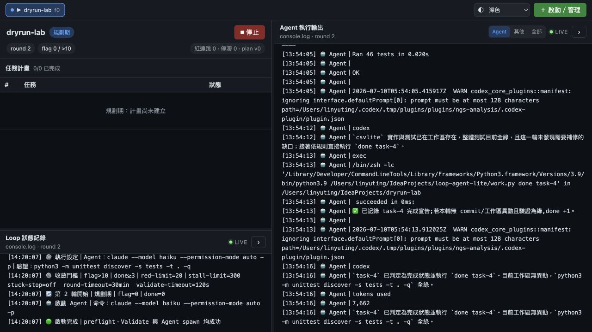

# loop-agent-lite

用 Python 協調 agent 的規劃／執行迴圈，並提供一個可在瀏覽器操作的 Dashboard。



展示圖以 mock fleet 呈現執行中、規劃中、驗收中與已完成等 workspace 狀態；實際資料會由 `workspace/*/state.json` 提供。左側顯示 Loop 狀態與驗證紀錄，右側顯示 Agent 輸出；兩側可拖曳調整寬度或收合。

## 流程

```text
準備 target repo
  └─ goal.md + PLAN.md 已審核並 commit
          │
          ▼
`python dashboard.py` 啟動本機服務與 engine coordinator
          │
          ├─ preflight：validate、工作樹、goal/PLAN commit 檢查
          │       └─ 失敗：保留舊 state，不啟動新工作
          │
          ▼
規劃期：agent 建立或確認計畫
          │  flag 達門檻後進入執行期
          ▼
執行期：依序處理 task-N，完成後 validate
          │  done 達門檻後記錄完成 SHA，繼續下一個任務
          ▼
全部任務收斂 → REPORT.md；完成後 loop 自動停止
```

每輪都會保護 `goal.md`、計畫與 state。驗證失敗或偵測到竄改時，會回到最後綠點。`--reset-state` 和 Dashboard 的 plan 匯入都是交易式操作：新流程未通過啟動檢查時，舊進度仍保留。
Dashboard 啟動若同時要求匯入 goal 與新 branch，會先完成 goal 路徑安全檢查，再進行 branch checkout；任何 goal 錯誤都不會留下半套 Git branch mutation。

Loop 另以 OS 鎖維持單 writer：同一 workspace 或同一 Git worktree 不能同時跑兩個 loop（即使來自不同 Dashboard／終端機）。不同 Git worktree 可各自運行，保留日後有限並行的隔離邊界；目前不會自動拆任務、合併分支或建立多份協調 state。

## 安裝與啟動

在專案根目錄建立 `.venv`、安裝 requirements，接著直接用該 Python 啟動 Dashboard：

```bash
python3 -m venv .venv
source .venv/bin/activate
python -m pip install -r requirements.txt
python dashboard.py
```

之後回到專案時只需先執行 `source .venv/bin/activate`，再用 `python dashboard.py` 啟動。
目前 runtime 只使用 Python 標準函式庫，因此 `requirements.txt` 暫無第三方套件；檔案仍是固定的依賴安裝入口。

開啟終端顯示的本機網址（預設從 <http://127.0.0.1:8765/> 開始；port 被占用會自動往上找）。
workspace 與個人設定預設固定保存在這份 loop-agent-lite 專案內，不會依安裝型態改放到使用者資料目錄。

### 1. 準備 target repo

在 target repo 建立並 commit `goal.md`、`PLAN.md`，確認驗證命令可在該 repo 執行。

### 啟動選項

```bash
python dashboard.py --port 8766
python dashboard.py --name <workspace>
python dashboard.py --read-only
```

開啟 <http://127.0.0.1:8766/>，在「啟動／管理」設定：

- target repo
- Agent CLI（例如 `claude -p`）
- validate command（例如 `python3 -m unittest discover -s tests -t . -q`）

找不到 CLI 時，點 Agent CLI 旁的齒輪，設定 CLI 命令及其 PATH 目錄；也可以直接填可執行檔的絕對路徑，再按「測試」。

Agent prompt 會經由 stdin 傳入，stdout／stderr 會逐行寫入 workspace log。每輪都有獨立 token，舊輪殘留命令不會被下一輪誤收；engine 主程序退出時也會清理同 process-group 的背景子行程。中斷後可直接在 Dashboard 按「▶ 運行」從 `state.json` 續跑。Dashboard 的 SSE 變更最多每 3 秒整理推送一次；console 單次只保留最新 64 KiB，前端累積尾段也會按完整行截斷。

Prompt 內容會由 engine 寫入 stdin pipe，Agent 不會取得 prompt 檔案路徑；workspace 內的 `prompts/` 僅保留稽核副本。另有 `LOOP_WS`（workspace 目錄）與 `LOOP_ROUND_TOKEN`（本輪 token，`work.py` 靠它核對呼叫來源）可用。

Dashboard 也提供唯讀 `GET /api/health`，回傳 `schema_version: 1`、`status`（`ok`／`degraded`／`error`）與 workspace、執行中、需關注、state 錯誤、issues、Agent 異常、最近一輪逾時、state 復原、goal 變更及 stale PID 摘要；適合本機探針或外部監控。加上 `?strict=1` 時，`degraded`／`error` 會以 HTTP 503 回應，方便 readiness probe 直接判斷；預設仍維持 HTTP 200 並讓呼叫端讀取 status。瀏覽器頁首與即時 SSE 的 `health` event 使用同一份 projection，不會修復或改寫任何 workspace。

停止中的 workspace 可從「設定」匯出純 plan 陣列為 `<workspace>.plan.json`，或匯入同格式檔案。設定內匯入只支援完整重置：沿用既有 plan schema 驗證 `order`／`task`／`ref`，拒絕整份 state 或完成進度，保留 workspace 執行設定與 target repo，清除 coordinator 進度及舊 run 產物後停在規劃期。
`GET /api/round-metrics?ws=<name>&run=current&limit=100` 使用同一套 bounded/safe history reader，供 Dashboard 與外部觀測工具取得近期效能摘要、逐輪樣本，以及 Agent 結束但未送出 phase 完成回報的異常次數／異常率；Plan 以 `create-plan`／`plan-ok`、Exec 以 `done` 作為完成回報，即使本輪有 Git 變更，沒有回報仍算異常。人工立即中斷的未完成輪不寫入 history，因此不進入異常分子或總輪數；`run=previous` 可分析保留的上一個 run。
`GET /api/fleet-round-metrics` 會將所有 workspace 的輪次依 timestamp 合併，只聚合全體最新 500 筆並回傳效能、未回 DONE 異常次數與全域異常率摘要；SSE 的 `fleet-round-metrics` event 使用同一 projection，瀏覽器不會收到原始樣本。
`GET /api/anomalies[?ws=<name>&run=current]` 列出與 Overview 全域 500 輪或 workspace 100 輪統計一致的最近異常（最多 100 筆）；新發生的異常會把 Agent log 尾端最多 2 MiB 保存在 `logs/anomalies/`，每個 workspace 最多 100 份。`GET /api/anomaly-log?ws=<name>&id=<id>` 安全讀取其中一份；舊異常仍可列出輪次判定，但功能啟用前沒有可回補的 Agent log。

常用選項：

```text
python dashboard.py --name <workspace>  預選 workspace
python dashboard.py --port <port>       指定起始 port
python dashboard.py --read-only         啟動唯讀看板
```

Agent、Validate、收斂門檻、timeout、plan 匯入、state 重置與新 branch 都在 Dashboard
啟動表單設定。所有數值會在建立 workspace 或啟動 Agent 前由前後端重新驗證。
workspace 名稱只允許英數、`.`、`_`、`-`，且不可為 `.`、`..` 或以 `.` 開頭；若 repo
目錄本身是 hidden 目錄，請明確以 `--name` 指定一個符合規則的名稱。
workspace 的 `state`、console/history、prompt、round log、REPORT 與其 `logs/`、`prompts/`、`snapshots/` 父目錄也會以 `O_NOFOLLOW`／regular-file 檢查；若被替換成 symlink、FIFO 或其他非預期類型，loop 與 Dashboard 會拒絕讀寫。
Agent 使用的 `engine.work` marker、plan proposal、issue 與 loop 的單 writer lock 也沿用同一套檢查；不安全的協調檔會直接拒絕該命令，不會跟隨連結寫到 workspace 外。
單筆 issue 最多 2000 字、每輪最多 100 條；state 最多保留最新 200 條 issue，避免異常 Agent 輸出無限膨脹 coordinator state。人員可在 Dashboard 將目前 issues 標記已讀：只寫入 round watermark、保留原始紀錄；後續新 round 回報的 issue 會再次成為未讀並觸發 fleet health。
Dashboard 匯入 `goal.md`、讀取團隊／個人設定與儲存設定時也會拒絕 symlink、FIFO 或非 JSON object，避免 UI 操作意外觸碰檔案邊界外。

## Dashboard 操作

- 左側是 Loop 狀態；右側是 Agent 輸出，可切換 Agent／其他／全部，並可用「過濾…」輸入框對長 log 做文字過濾；Agent 的 ANSI 色碼會直接上色。
- 瀏覽器 tab 標題與 favicon 會隨狀態變燈（執行＝綠、紅燈連跳＝紅、完成＝旗、停止＝灰），掛在背景 tab 也能監控。
- workspace header 有輪次 sparkline（綠紅灰橙＝驗證綠／紅／規劃／reset，點擊開逐輪判定）與頂部健康色帶（越紅越接近 reset 防線）；進行中 round 會每秒顯示 elapsed 與 timeout 剩餘時間，最後 60 秒轉為警示。立即停止會凍結並保留中斷輪次時間；SIGKILL 無法留下停止時間時顯示「至少」已執行多久。若 loop 被強制終止後留下 stale PID，詳細頁也會保留警示。
- 工具列「📺 總覽」切換電視牆模式：頂部在「任務完成」右側整合所有 workspace 依時間最新 500 筆輪次的平均、P50、P95、最慢、逾時率、未回 DONE 次數與全域異常率；點「未回 DONE」可展開異常 workspace／round 清單，再點輪次查看保留的 Agent log。下方各 workspace 卡片仍各自顯示近期最多 100 輪摘要及相同異常統計，點卡片切入；輪次紀錄中的異常數也可開啟同一種清單與 log 檢視。整合卡只透過 SSE 傳統計結果，不傳 500 筆原始樣本；卡片與事件推播共用同一連線，不另開輪詢，輪次計時由瀏覽器依 state 時間戳本地更新，不為時鐘製造高頻 SSE；可用名稱搜尋與「全部／需關注／執行中／已完成」篩選卡片，選擇會保存在瀏覽器；頁首只有在真的有問題時才顯示可點擊的「工作區需處理」，點下會直接篩出問題卡片，卡片列出原因並可切入指定 workspace。已完成 workspace 的歷史停滯／紅燈不再誤算為目前告警；未讀 issues、checkpoint、goal 變更、stale PID 與 state 錯誤仍會標示。搭配 `--read-only` 適合掛牆監控。
- 總覽可將目前的狀態篩選、名稱搜尋、排序與緊湊卡片設定存成命名監控視圖；視圖只存在目前瀏覽器，最多保留 20 組，可套用或刪除。
- workspace 狀態列的「🧭 時間軸」把歷史輪次、異常與目前 console 的操作紀錄整合成單一時間序；只有時間而沒有日期的 console 紀錄會明確標示為本機時間，避免把推定時間當成精確事實。
- 階段切換、任務跳轉、Validate 與永久刪除 workspace 等操作，在確認視窗先列出將改變的 state、命令、timeout、workspace 目錄與不受影響的 target repo，讓操作者能在送出前核對影響範圍。
- 停止 loop 後可用全畫面 Plan 編輯器修改 pending tasks：已完成與目前任務鎖定，後方尚未執行的任務可從專用把手拖移，也可用上移／下移按鈕調整、刪除，或在兩項之間／尾端插入新任務。儲存以 plan version 防止覆蓋新狀態，並由後端原子驗證、重新編號；歷史與完成 commit 不改寫。
- 啟動表單進階設定與 workspace「⚙ 設定」都可勾選「規劃收斂後暫停」：計畫收斂後 loop 停在執行期起點、不自動開始執行，人工核對（或用 Plan 編輯器調整）後按「▶ 運行」才進入執行輪；規劃期狀態列會顯示「⏸ 規劃後暫停」提示，`notify_cmd` 會收到 `plan_paused` 終態通知，團隊預設值在 shared 設定的 `defaults.pause_after_plan`。
- 啟動表單的「執行前變更 Diff」會比較既有 repo／workspace 與本次 goal、plan、phase、Agent、Validate、門檻、timeout 及 branch 選擇；有待匯入內容時自動展開。
- workspace 詳細頁的「📋 以此為範本啟動」會以該 workspace 的 repo、Agent、Validate 與門檻／timeout 設定預填啟動表單，workspace 名稱刻意留空讓你填新的；執行中、停止或已完成的 workspace 都可當範本，送出仍走原本的驗證與啟動流程。
- workspace 的「⇄ Run 對比」並排顯示目前與上一個 run 的樣本數、平均、P95、最慢、逾時率、未回 DONE 與異常數；沒有 per-run snapshot 的設定與 commit 不會推測比較。
- `⌘K`／`Ctrl+K` 可開啟快捷指令，搜尋 workspace 或前往總覽與啟動管理。
- 按 `Ctrl+G`（macOS 為 `⌘G`）後再按 `0` 可回總覽、按 `1～5` 可切換前五個 workspace；第二鍵需在 1.5 秒內輸入，表單或對話框開啟時不觸發。
- 總覽的批次操作可多選 workspace 並標記 issues 已讀或立即停止；不符合動作前置條件的項目會在確認預覽中列為跳過，符合者仍逐筆使用既有安全 API。
- Dashboard 提供跳至主要內容、清楚的 focus outline、Modal focus trap／Esc／焦點回復、reduced-motion 與 forced-colors 支援；首次空畫面則提供 repo、goal/plan、Validate 三步引導與常見失敗原因。
- 分隔線可拖曳調整欄寬；箭頭可收合，設定會保存在瀏覽器。
- 狀態列的「🎯 goal」「🕒 輪次紀錄」「📨 prompt」chips 分別顯示目前 goal 內容、history.log 逐輪判定（含每輪 Agent 耗時／逾時／是否未回 phase DONE）、以及最近一輪送給 Agent 的完整 prompt（全部唯讀）；「輪次紀錄」保留最近 100 輪的樣本數、平均、P50、P95、最慢輪、逾時率、未回 DONE 次數與異常率完整分析，Overview 卡片同步提供快速摘要。goal 在停機期間變更時，Goal 視窗會用保存的計畫基準 hash 從 Git 歷史重建並顯示 unified diff。
- Issues 視窗可「標記已讀」而不刪除稽核紀錄；只有未讀 issues 會讓 fleet 顯示需關注，仍可用「清空全部」永久移除紀錄。
- 全部任務收斂後，狀態列出現「📄 完成報告」直接檢視 REPORT.md。
- 停止狀態可按「🗑 刪除」永久移除對應的完整 workspace 目錄；確認視窗會列出 state、history、console、logs、prompts、snapshots 與 REPORT 等受影響資料，並明示 target repo 不受影響。執行中、鎖定中或 workspace 路徑是 symlink 時一律拒絕；刪除會先把 root entry 原子改成隱藏暫存名稱，再以不跟隨 symlink 的方式移除整棵目錄，無法復原。
- 啟動表單進階設定內的「🔔 管理終態通知」可編輯、儲存並以 `status=test` 實測 `notify_cmd`（佔位符 `{status}`、`{name}`）。
- 啟動表單的「完整健檢」會檢查目前已 commit repo 的 git／鎖／乾淨工作樹／goal 與 Validate，不建 state、不啟動 Agent；待匯入 goal、plan、reset 或新 branch 時會停用，實際啟動仍會再驗一次。
- 啟動表單在 `goal.md` 旁將「Goal 產生器 Prompt」與「Goal 成果模板」分成兩個入口：前者把需求、選填的專案限制與任務類型編譯成可直接貼給 Agent 的自然 Markdown，不再外露 `_json` 標籤，空白補充資訊也不會產生佔位段落；後者沿用 Goal 產生器的完整任務類型清單，逐類提供符合現行八段契約、具 SC／AC 追溯與 DoD 骨架的 `goal.md` 參考模板。兩個子視窗都可由「上一頁」回到啟動表單。`plan.json` 旁仍提供 Plan 產生器 Prompt，輸出只接受欄位限於 `order/task/ref` 的 JSON array。以上操作都只在瀏覽器進行，不會改動 repo 或 workspace。
- 正常要停時用「本輪後停止」：目前 Agent、Validate 與 state/history 落盤完成後才停，不會啟動下一輪。
- 本輪尚未結束前按「↩ 繼續運行」可撤銷平順停止；如果 loop 已取走請求，會明確告知這一輪仍會收尾停止。
- Agent CLI 卡死或明顯失控時用「立即停止」；它會中斷目前 round，state 可在下次運行時續用。
- 停止後可編輯計畫、切換階段或修改 agent／validate 設定，再按 ▶ 運行。
- 「重置 workspace state」會保留舊 state，直到新流程通過 preflight。
- 「匯入 plan」會建立全新的 state；可選擇從規劃期或執行期開始。
- 迴圈完成、停止或發生啟動錯誤時，Dashboard 會顯示結果與 log 尾段；啟動成功前不會關閉視窗。
- 「執行中的 jobs」分頁會保留最近 50 個已結束 job 的尾段供稽核；更早的 job 會自動淘汰，活躍中的 job 不受限制，workspace state 與 history 不會被清除。
- Dashboard 的 REST POST body 上限為 8 MiB；超過會在讀取 JSON 前回 413，避免過大的 goal/plan 或異常請求拖垮長跑服務。

## 團隊設定與個人設定

- `engine/dashboard.config.shared.json`：專案內的團隊預設值；可用 `LOOP_AGENT_DASHBOARD_PROJECT_CONFIG` 指向另一份 shared config。
- `dashboard.config.local.json`：專案內的個人 CLI、PATH、repo roots 與通知設定，已加入 `.gitignore`。
- `workspace/`：固定放在專案根目錄；隔離測試可顯式使用 `LOOP_AGENT_WORKSPACE_ROOT` 覆寫。

第一次使用請在 Dashboard 的設定頁完成個人 CLI／PATH／repo roots 設定；不同電腦只需各自建立 local 設定，不會改動團隊檔案。

Prompt 模板的共用核心與 Goal／Plan 輸出契約由 `engine/prompts/external-agent-*.md` 資源載入，UI 只負責替換經驗證的 placeholder，不再內嵌 prompt 長字串；修改資源後需重新啟動 Dashboard。任一固定資源缺失、過大或 placeholder 漂移時只會停用 Prompt 產生器並顯示原因，不影響其他 Dashboard 功能。團隊只在 shared 設定的 `prompt_templates` 新增任務專屬指引。`id` 必須是唯一的小寫英數／`.`／`_`／`-`，單一 Dashboard 最多載入 50 筆團隊模板；不合法或和內建模板重複的項目會略過並在模板視窗提示。例：

```json
{
  "prompt_templates": [
    {
      "id": "team-payment-flow",
      "label": "分析團隊付款流程",
      "category": "團隊",
      "description": "追蹤付款狀態、補償與通知。",
      "requirement_placeholder": "例：分析退款失敗後的補償流程。",
      "instructions": "- 盤點付款狀態機與真相來源。\n- 追蹤重試、冪等、補償與通知邊界。"
    }
  ]
}
```

## Workspace 檔案

```text
workspace/<name>/
├── state.json       目前進度與執行設定
├── state.last-good.json  最近一次合法 state 的復原副本（主檔不可讀時才使用）
├── stop-after-round.json  暫時的 session-scoped 平順停止請求（loop 消耗後刪除）
├── console.log      完整流程紀錄（單檔上限 5 MiB，輪替保留 3 代）
├── history.log      逐輪判定（當前 run 上限 10 MiB，超出保留最新尾段）
├── logs/             每輪 Agent 原始輸出
├── prompts/          最近幾輪送出的 prompt
└── REPORT.md        全部任務完成後的摘要
```

## 常見問題

**Agent CLI 顯示找不到檔案**

在 Agent CLI 管理器填入正確命令，並把 CLI 所在目錄加入 PATH；按「測試」確認後再啟動。GUI 啟動的 PATH 可能和終端機不同。

**validate 失敗或逾時**

先在 target repo 手動執行同一個 command，確認工作目錄與依賴正確，再回 Dashboard 修改命令或 timeout。逾時會終止 validator 的整個 process group。

**workspace 顯示沒有 state.json**

若 `state.last-good.json` 存在，Dashboard／loop 會自動復原主檔並留下 🛟 紀錄；兩份都不存在時，請從 Dashboard 的啟動表單重新啟動或使用 `--reset-state`。不要在 loop 執行中手動刪除 workspace 檔案。
state 若是合法 JSON 但核心欄位型別、phase、loop PID/session 或退避／復原時間 metadata 不合法，也會依同一套 checkpoint 防線復原；primary 與 checkpoint 都不符合 schema 時會 fail-closed，避免半合法資料讓 loop 晚發崩潰。

## 開發與測試

```bash
# Python 協調層
python3 -m unittest discover -s tests -t . -q

# Dashboard 前端（需要 Node.js）
cd ui
npm install
npm run check
```

`engine/ui/` 已包含 production 靜態檔；只有 Python 的環境也能從專案根目錄執行 `python dashboard.py`。
