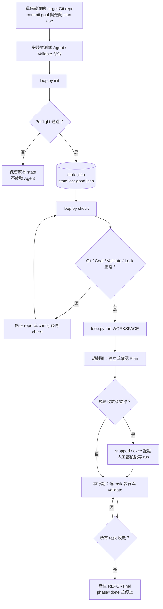
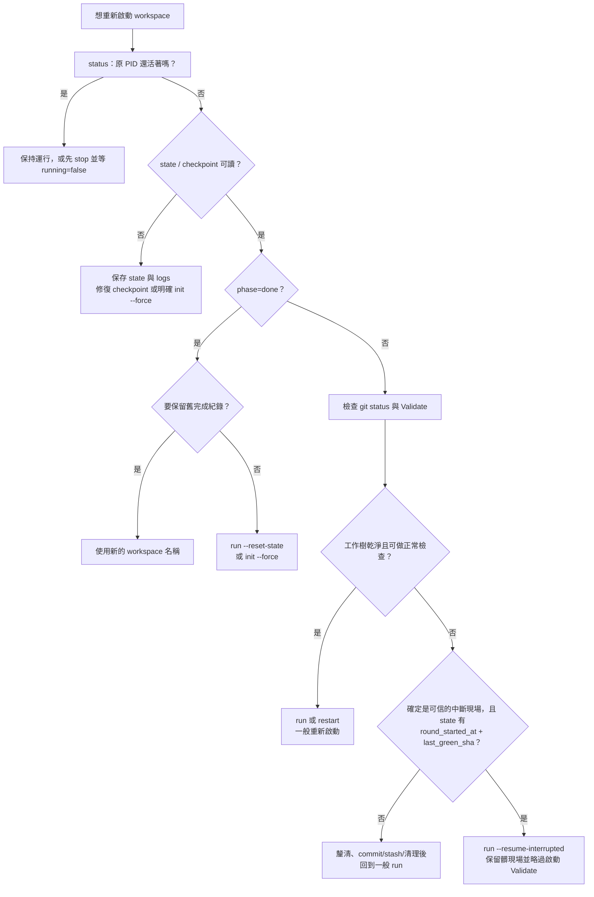
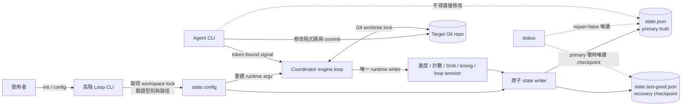
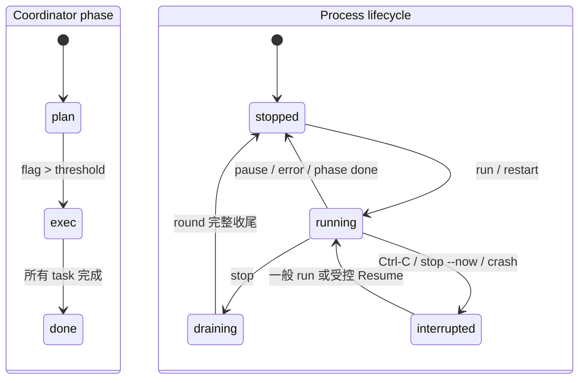

# 單一 Workspace CLI 完整指南

這份指南說明如何只用終端機管理一個 loop-agent-lite workspace：從安裝、`init`、`check`、`run`、`status`、停止，到一般重新啟動、保留中斷現場的 Resume 與完整 Reset。CLI 不需要先啟動 Dashboard；兩者讀寫相同的 `workspace/<name>/state.json`。

> 本文件中的 **Loop CLI** 是 `python loop.py ...`；**Agent CLI** 是每一輪真正接收 prompt 的 Codex、Claude 或其他非互動命令。兩者不是同一個程式。

`loop.py` 是 `engine.cli` 的專案根目錄入口，以下兩種寫法等價：

```bash
python loop.py --help
python -m engine.cli --help
```

## 先看完整流程



## 1. 安裝與前置條件

需要：

- Python 3。
- Git，且 target repo 已有至少一個 commit。
- 一個可從 stdin 接收 prompt、非互動執行並自行結束的 Agent CLI。
- 一條能代表 Definition of Done 的 Validate 命令。
- Target repo 工作樹乾淨；`goal.md` 與選配的 plan 參考文件已 commit。

從 loop-agent-lite 專案根目錄安裝：

```bash
python3 -m venv .venv
source .venv/bin/activate
python -m pip install -r requirements.txt
python loop.py --help
```

準備本指南後續命令使用的變數；請把 repo 路徑與 workspace 名稱換成自己的值：

```bash
REPO=/absolute/path/to/target-repo
WS=my-workspace
```

先檢查 repo、Goal 與 Agent CLI：

```bash
git -C "$REPO" rev-parse --show-toplevel
git -C "$REPO" rev-parse HEAD
git -C "$REPO" status --short
git -C "$REPO" ls-files --error-unmatch goal.md
command -v claude
```

`git status --short` 應沒有輸出。若使用的不是 `claude`，把最後一行換成實際 Agent executable。Loop CLI 直接繼承目前 shell 的環境與 `PATH`；不像 Dashboard，它沒有額外 PATH 設定頁。

Agent、Validate 與通知命令會以 `shlex` 拆成 argv 後直接執行，不會自動套用 shell 的 alias、function、pipe、`&&` 或變數展開。需要 shell 語法時，明確包成一個 shell 命令，例如：

```bash
VALIDATE_CMD='sh -lc "ruff check . && pytest -q"'
```

不要把 token 或密碼直接寫入 `state.json` 的命令字串；讓命令從環境、keychain 或受控的 credential helper 取得。

## 2. 五分鐘 Quick Start

以下範例使用 `claude -p` 作為 Agent CLI，Validate 使用 Python unittest；請依 target repo 更換兩條命令：

```bash
python loop.py init \
  --repo "$REPO" \
  --name "$WS" \
  --agent-cmd 'claude -p' \
  --validate-cmd 'python3 -m unittest discover -s tests -t . -q'

python loop.py config "$WS"
python loop.py check "$WS"
python loop.py run "$WS"
```

`init` 完成後只建立 stopped workspace，不啟動 Agent；`run` 是前景長跑程序。另開一個已啟用相同 virtualenv 的終端機即可觀察或停止：

```bash
source .venv/bin/activate
WS=my-workspace
python loop.py status "$WS" --watch --on-change
python loop.py stop "$WS"
```

## 3. 命令總覽

| 命令 | 用途 | 是否執行 Agent | 是否修改 state |
|---|---|---:|---:|
| `init` | Preflight 後建立 stopped workspace | 否 | 成功時建立；`--force` 可交易式重建 |
| `check` | 依保存設定執行 Git、Goal、Validate、lock 健檢 | 否 | 否；但會留下 console 記錄 |
| `run` | 依 `state.config` 前景執行 | 是 | 是 |
| `restart` | `run` 的同義命令 | 是 | 是 |
| `status` | 唯讀顯示單一 workspace | 否 | 否 |
| `config` | 顯示或安全更新 stopped workspace 的 `state.config` | 否 | 指定選項時是 |
| `stop` | 預設要求本輪完整收尾後停止 | 否 | 建立 session-bound stop marker |
| `stop --now` | 緊急中斷目前 round | 否 | 中斷時盡力落盤 |

完整參數以程式輸出為準：

```bash
python loop.py init --help
python loop.py run --help
python loop.py status --help
python loop.py config --help
```

## 4. Workspace Root 與單 Writer

預設資料固定放在這份 loop-agent-lite checkout 的 `workspace/`。若要隔離測試，可在每一條命令的 subcommand **之前**指定相同 root：

```bash
python loop.py --workspace-root /tmp/loop-agent-workspaces init \
  --repo "$REPO" --name "$WS" \
  --agent-cmd 'claude -p' --validate-cmd 'pytest -q'

python loop.py --workspace-root /tmp/loop-agent-workspaces status "$WS"
```

也可以固定環境變數，避免不同命令誤用不同 root：

```bash
export LOOP_AGENT_WORKSPACE_ROOT=/tmp/loop-agent-workspaces
python loop.py status "$WS"
```

同一時間：

- 同一 workspace 只能有一個 writer。
- 同一 Git worktree 只能有一個 loop，即使 workspace 名稱不同。
- 不同 Git worktree 可以各自使用不同 workspace。

鎖衝突時應找出原本的 loop 並停止；不要刪 `.run.lock` 或 Git worktree 的 lock 檔來繞過保護。

## 5. Init：建立 stopped Workspace

### 基本初始化

```bash
python loop.py init \
  --repo "$REPO" \
  --name "$WS" \
  --goal goal.md \
  --agent-cmd 'claude -p' \
  --validate-cmd 'pytest -q'
```

`--name` 省略時使用 target repo 目錄名。名稱只允許英數、`.`、`_`、`-`，不可為 `.`、`..` 或以 `.` 開頭。

`--goal` 與 `--plan-doc` 必須是 target repo 內的相對路徑、存在於 `HEAD`，不能逃出 repo：

```bash
python loop.py init \
  --repo "$REPO" \
  --name "$WS" \
  --goal docs/goal.md \
  --plan-doc docs/architecture.md \
  --agent-cmd 'claude -p' \
  --validate-cmd 'pytest -q'
```

Init 會取得 workspace 與 Git worktree lock，確認 repo、乾淨工作樹、受保護文件及 Validate，全部通過後才原子提交 `state.json` 與 checkpoint。失敗時不啟動 Agent，也不以半套 state 取代舊進度。

### 匯入 Plan

Plan 是 JSON array，不是整份 state：

```json
[
  {
    "order": 1,
    "task": "實作登入狀態保存，加入正常、過期與竄改案例測試，執行 pytest -q 全綠。",
    "ref": "goal.md#驗收條件"
  },
  {
    "order": 2,
    "task": "更新操作文件並檢查所有文件連結。"
  }
]
```

每項只接受連續的正整數 `order`、非空 `task` 與選配字串／`null` 的 `ref`。從規劃期讓 Agent 再審核：

```bash
python loop.py init \
  --repo "$REPO" --name "$WS" \
  --agent-cmd 'claude -p' --validate-cmd 'pytest -q' \
  --import-plan /absolute/path/to/plan.json \
  --start-phase plan
```

Plan 已人工審核、可直接從 task-1 開始時：

```bash
python loop.py init \
  --repo "$REPO" --name "$WS" \
  --agent-cmd 'claude -p' --validate-cmd 'pytest -q' \
  --plan /absolute/path/to/plan.json \
  --start-phase exec
```

`--plan` 是 `--import-plan` 的短別名；`--start-phase exec` 只能搭配其中之一。

### 重新 Init 既有名稱

未加 `--force` 時，`init` 會拒絕已有 state 的 workspace。要沿用進度請執行 `run`／`restart`；只有確定要用 init 當下提供的完整設定與選配 Plan 取代舊協調進度時才使用：

```bash
python loop.py init \
  --repo "$REPO" --name "$WS" \
  --agent-cmd 'claude -p' --validate-cmd 'pytest -q' \
  --force
```

`--force` 是交易式重建：先通過 Preflight 才取代舊 state。它不是「忽略錯誤」選項。

## 6. Check：啟動前健檢

Init 後、修改 config 後或重新啟動前，可以執行：

```bash
python loop.py check "$WS"
```

Check 使用 `state.config`，驗證：

- Target path 是有 commit 的 Git repo。
- 沒有同 workspace／Git worktree writer。
- 工作樹乾淨。
- Goal 與選配 plan doc 已 commit。
- Validate 在 timeout 內 exit 0。
- Validate 執行後沒有把工作樹弄髒。

它不啟動 Agent、不建立新 state、不重設進度，也不更新 protected snapshots；但診斷訊息會附加到 workspace `console.log`。

## 7. Run、Status 與 Stop

### 前景執行

```bash
python loop.py run "$WS"
```

`run` 從 `state.config` 重建所有 runtime 參數，取得鎖並執行正常啟動檢查，然後以前景程序進入 loop。終端機關閉會影響程序；長跑時應使用團隊核准的 process manager／terminal multiplexer，並保留可觀測 log。

一般 Run 會拒絕髒工作樹。啟動 Validate 若是紅燈，只有在既有 `last_green_sha` 仍是合法、可信且 protected snapshot 一致時才可能沿用綠點繼續修復；全新 workspace 沒有可信綠點時會 fail-closed。

Workspace 已是 `phase=done` 時，普通 `run` 會拒絕；請選新 workspace，或明確使用 Reset。

### 唯讀狀態

```bash
python loop.py status "$WS"
python loop.py status "$WS" --json
python loop.py status "$WS" --metrics 100
python loop.py status "$WS" --watch --on-change --interval 2
```

供 shell／CI 判斷「需要關注」：

```bash
python loop.py status "$WS" --check
echo $?
```

`--check` 遇到 state 錯誤、stale PID、未讀 issues、Goal 變更、Agent 異常等需關注狀態時 exit 1；它不可和 `--watch` 同時使用。`--metrics N` 接受 `0..500`，`0` 代表不掃描 history。

Run 尚在 Preflight／啟動 Validate、還沒把正式 session PID 寫入 state 時，status 會用實際 `.run.lock` owner 顯示「啟動檢查中」（JSON 為 `starting: true`），不會誤報已停止。

### 平順停止

在另一個終端機執行：

```bash
python loop.py stop "$WS"
python loop.py status "$WS" --watch --on-change
```

預設 `stop` 只寫入綁定目前 PID 與 session 的停止要求。Loop 會完成當前 Agent、Validate、state/history 落盤，然後不啟動下一輪；命令回傳不代表當前 round 已經結束，應用 `status` 等待 `running=false`。

若仍在 startup、session 尚未公開，平順停止會請你稍候；確實需要中斷啟動檢查時可明確使用 `stop --now`，CLI 仍會以同一 workspace root 的 kernel flock owner 核對目標 PID。

Loop CLI 目前沒有撤銷平順停止要求的 subcommand；要求送出後請等本輪收尾，再用一般 `run`／`restart` 啟動。舊版 state 若沒有 `loop.session_id`，無法建立安全的 session-bound 要求，CLI 會請你改用 `stop --now`。

### 緊急停止

只有 Agent 卡死、失控或正在執行危險動作時使用：

```bash
python loop.py stop "$WS" --now
```

它會送 SIGINT 並等待最多 15 秒，讓 coordinator 終止 Agent process group、凍結中斷時間、清除 PID 並保存 state。若仍未停止，CLI 會回傳非零且**不會自動 SIGKILL**，避免只殺 coordinator 卻留下 orphan Agent；此時先查 process tree 與 `console.log`，再人工處理。立即停止可能留下未 commit、未 Validate 的髒工作樹；下一步先檢查 repo，不要直接 Resume。

直接在前景 Run 終端按 `Ctrl-C` 會中斷並盡力保存 state，通常以 exit 130 結束。

## 8. Restart、Resume 與 Reset



### 三種模式比較

| 目的 | 命令 | 保留 coordinator 進度 | 保留髒工作樹 | 啟動 Validate | 典型用途 |
|---|---|---:|---:|---:|---|
| 一般重新啟動 | `run` 或 `restart` | 是 | 否 | 是 | 平順停止、process 重開、設定更新後續跑 |
| Resume 中斷現場 | `run --resume-interrupted` | 是 | 是 | 略過 | 已確認的未完成 round 現場 |
| Reset 全新 run | `run --reset-state` | 否 | 否 | 是 | 放棄所有協調進度，從規劃期重來 |

`restart` 完全等同 `run`：

```bash
python loop.py restart "$WS"
```

一般重新啟動是預設答案。它會保留 phase、Plan、目前 task、completed、輪次與綠點，但重新做正常啟動保護。

### Resume 中斷現場

先核對：

```bash
git -C "$REPO" status --short
git -C "$REPO" rev-parse HEAD
python loop.py status "$WS" --json
```

只有同時滿足以下條件才使用：

- 變更確實來自剛才被中斷的目前工作，不是未知 WIP。
- `state.round_started_at` 是有效且早於現在的時間。
- `state.last_green_sha` 是 target repo 內存在的 commit。
- 沒有其他 loop 使用同一 workspace／Git worktree。
- 你接受略過啟動 Validate，並會在本輪結束時接受正常 Validate。

```bash
python loop.py run "$WS" --resume-interrupted
```

Resume 仍保留 Git/workspace identity 與單 writer 鎖；它會保留工作樹、略過啟動 dirty-tree／Validate／HEAD 祖先／舊 protected snapshot 比對，並把目前 protected 文件重新建立為後續防竄改基準。它不是繞過 lock、錯誤 state 或未知變更的通用按鈕。

高階 CLI 不提供竄改 `round_started_at` 或 `last_green_sha` 的選項。資料不存在或不可信時，不要為了讓 Resume 可按而手填；整理 repo 後使用一般 `run`。

### Reset 全新 Run

```bash
python loop.py run "$WS" --reset-state
```

它沿用目前 `state.config`，但建立全新的規劃期 state：Plan、round、completed、issues、計數與目前 task 全部清除。Preflight／Validate 通過後才提交，因此啟動檢查失敗時舊 state 仍保留。

提交 Reset 後：

- `history.log` 輪替為 `history.log.1`。
- 舊 `REPORT.md`、round logs 與 prompts 被清除。
- Target repo 程式碼不會因 Reset 本身自動 rollback。

若要同時換 Agent／Validate／Goal／Plan 或 target repo，使用完整的 `init --force`；若要保留舊完成稽核，優先建立新 workspace 名稱。

## 9. Config：安全修改 `state.config`

### 顯示目前設定

```bash
python loop.py config "$WS"
```

### 原子更新

Workspace 必須停止。只會更新有傳入的選項，其他值保持不變；成功後同步寫入 primary 與 checkpoint，從下一次 `check`／`run`／`restart` 生效：

```bash
python loop.py config "$WS" \
  --done-threshold 4 \
  --round-timeout 45 \
  --validate-timeout 180

python loop.py check "$WS"
python loop.py restart "$WS"
```

切換 Agent 與 Validate：

```bash
python loop.py config "$WS" \
  --agent-cmd 'claude -p' \
  --validate-cmd 'sh -lc "ruff check . && pytest -q"'
```

切換布林選項或清空選配字串：

```bash
python loop.py config "$WS" --pause-after-plan
python loop.py config "$WS" --no-pause-after-plan
python loop.py config "$WS" --stuck-stop
python loop.py config "$WS" --no-stuck-stop
python loop.py config "$WS" --notify-cmd ''
python loop.py config "$WS" --plan-doc ''
```

`config` 不允許修改 `config.repo`；workspace 綁錯 repo 時，使用新名稱重新 init，或在充分了解會清除進度的前提下完整 `init --force`。

### Runtime 參數表

| `state.config` 欄位 | Init／Config 選項 | 預設 | 規則與效果 |
|---|---|---:|---|
| `repo` | `init --repo` | 必填 | 正規化為絕對路徑；必須和頂層 `repo_binding` 一致，`config` 不可改 |
| `agent_cmd` | `--agent-cmd` | Init 必填 | 非空、可由 `shlex` 解析；prompt 經 stdin 傳入 |
| `validate_cmd` | `--validate-cmd` | Init 必填 | 非空、可由 `shlex` 解析；啟動前與每輪執行 |
| `goal` | `--goal` | `goal.md` | Repo-relative、非空、必須已 commit |
| `plan_doc` | `--plan-doc` | 空字串 | 選配 repo-relative 參考文件；提供時必須已 commit |
| `flag_threshold` | `--flag-threshold` | `10` | `flag > threshold` 才離開規劃期；必須為 ≥1 整數 |
| `done_threshold` | `--done-threshold` | `3` | `done_count >= threshold` 才完成 task；必須為 ≥1 整數 |
| `red_limit` | `--red-limit` | `20` | 執行期連續紅燈達值時回最後綠點；≥1 整數 |
| `stall_limit` | `--stall-limit` | `300` | HEAD 無進展達值時回最後綠點；≥1 整數 |
| `stuck_stop` | `--stuck-stop`／`--no-stuck-stop` | `false` | 是否在同一 task reset 達上限後停機 |
| `stuck_stop_count` | `--stuck-stop-count` | `100` | 搭配 `stuck_stop`；≥1 整數 |
| `round_timeout` | `--round-timeout` | `30` 分 | 單輪 Agent 上限；有限數字且 ≥0，`0`=不限 |
| `agent_backoff_max` | `--agent-backoff-max` | `60` 秒 | CLI 連續異常的指數退避上限；≥0，`0`=關閉退避 |
| `validate_timeout` | `--validate-timeout` | `120` 秒 | 啟動前／每輪 Validate 上限；有限數字且 >0 |
| `pause_after_plan` | `--pause-after-plan`／`--no-pause-after-plan` | `false` | 規劃收斂後停在 exec 起點，等待下一次一般 Run |
| `notify_cmd` | `--notify-cmd` | 空字串 | 終態通知；支援 `{status}`、`{name}`，timeout 15 秒，失敗只記 warning |

通知可能收到 `completed`、`plan_paused`、`stuck_stop`、`goal_missing`、`reset_broken`。命令替換後直接執行，不經 shell。

設定 precedence：

1. `init` 將明確參數與程式預設保存到 `state.config`。
2. `config` 只覆寫指定欄位。
3. `check`、`run`、`restart` 一律以保存的 `state.config` 為準，沒有另外的 tuning flags。
4. `run --reset-state` 沿用保存 config；`init --force` 以這次完整 init 參數取代 config。

## 10. `state.json` 欄位與所有權



### 不要直接編輯 state

`state.json` 是 coordinator 的 runtime 真相，不是一般設定檔。安全做法：

- 查看設定：`python loop.py config "$WS"`。
- 修改設定：`python loop.py config "$WS" --...`。
- 查看進度：`python loop.py status "$WS" --json`。
- 改變生命週期：使用 `run`、`stop`、Resume、Reset 或重新 Init。

不要用 editor、`sed -i`、`jq > state.json` 修改；不要直接改 `state.last-good.json`，也不要手動清 PID、計數、SHA、Plan 或 completed。執行中的外部寫入會被視為竄改；合法 primary 在受控載入時也可能刷新 checkpoint，因此 checkpoint 不是拿來抵銷人工誤改的長期備份。

### 完整欄位分組

目前 state 頂層沒有供使用者自行遞增的 schema version；舊 workspace 可省略部分新欄位，engine 會以相容預設讀取。以下是目前 coordinator 使用的完整欄位群組。

#### A. 可透過 `config` 修改

| 欄位 | 型別 | 所有者 |
|---|---|---|
| `config` | object | 高階 CLI／Dashboard；子欄位完整定義見前一節參數表 |

只有 `config` 內白名單欄位是一般使用者設定。`repo` 只在 Init 綁定；其餘支援的更新項目以 `python loop.py config --help` 為準。

#### B. Phase、Plan 與完成進度

| 欄位 | 型別 | 意義 |
|---|---|---|
| `phase` | `plan`／`exec`／`done` | Coordinator 階段；不要和 process running 混淆 |
| `round` | 非負整數 | 當前 run 的累計輪數 |
| `flag` | 非負整數 | 規劃期連續共識計數 |
| `plan` | array | 任務陣列；每項為 `{order, task, ref?}` |
| `plan_version` | 非負整數 | Agent 接受／提交 Plan 的版本 |
| `current_order` | 非負整數或 `null` | 目前 task order；新規劃期通常為 `0` |
| `done_count` | 非負整數 | 目前 task 的連續完成共識計數 |
| `completed` | array | 完成項目；含 `order`、完整 `sha`、`round`，通常含 `base_sha`，人工操作可含 `human` |
| `current_task_base_sha` | 完整 SHA 或 `null` | 目前 task 淨變更的 Git 起點 |
| `last_green_sha` | commit SHA 或 `null` | 最近可信、Validate 通過的回復錨點 |
| `repo_binding` | 絕對路徑字串或 `null` | Workspace 的 target repo identity；位於可調 config 外，舊 state 首次受控啟動時遷移 |

這些欄位只能由 coordinator、受驗證 Plan／phase 操作或 Reset 更新，不屬於 `config`。

#### C. 健康、Reset 與 Round Timing

| 欄位 | 型別 | 意義 |
|---|---|---|
| `red_streak` | 非負整數 | 連續驗證紅燈輪數 |
| `stall_rounds` | 非負整數 | HEAD 沒有前進的輪數 |
| `task_reset_counts` | object | task order 字串到 reset 次數的對應 |
| `agent_failure_streak` | 非負整數 | Agent CLI 連續異常次數 |
| `agent_backoff_seconds` | 有限非負數 | 目前計算出的退避秒數 |
| `agent_backoff_until` | 時間字串或 `null` | 下一次嘗試時間 |
| `last_round_seconds` | 有限非負數 | 上一輪 Agent 耗時 |
| `last_round_timed_out` | boolean | 上一輪是否逾時 |
| `round_started_at` | 時間字串或 `null` | 目前／最近中斷輪的開始時間；Resume 資格之一 |
| `round_deadline_at` | 時間字串或 `null` | 有 timeout 時的 deadline |
| `round_interrupted_at` | 時間字串或 `null` | 人工中斷時間 |

#### D. 稽核、Issues、Goal 與 Recovery

| 欄位 | 型別 | 意義 |
|---|---|---|
| `notes` | string array | 下一輪 prompt 使用的 coordinator 備註 |
| `issues` | object array | Agent 回報；每項含 `round`、`text`，可含 `where`、`ts` |
| `issues_acknowledged_round` | ≥-1 整數 | 人員已讀 watermark；不刪原始 issue |
| `goal_hash` | SHA-256 或 `null` | 本次觀測的 Goal 內容 hash |
| `goal_previous_hash` | SHA-256 或 `null` | Goal 變更時保留的舊基準 hash |
| `goal_changed` | boolean | 現有 Plan 是否可能依據舊 Goal |
| `state_recovery_count` | 非負整數 | 從 checkpoint 受控復原次數 |
| `last_state_recovery` | 時間字串或 `null` | 最近一次 recovery 時間 |

#### E. Process Session

| 欄位 | 型別 | 意義 |
|---|---|---|
| `loop` | object | 當前／上一個 process session |
| `loop.pid` | 正整數或 `null` | 正常停止會清為 `null`；SIGKILL／斷電可能留下 stale PID |
| `loop.session_id` | string | 綁定本輪後停止 marker，避免舊要求跨重啟生效 |
| `loop.started_at` | time string | 本次 loop process 開始時間 |

Phase 與 process 是兩條不同狀態軸：



`phase=exec` 不代表 process 正在跑；`phase=done` 也可能仍保留需關注的 issues 或 stale PID。

## 11. Checkpoint 與損壞復原

每次受控保存都採用同目錄暫存檔、`fsync`、原子 replace，並依序更新：

1. `state.json`：primary truth。
2. `state.last-good.json`：最近一次合法、完整 state 的 recovery copy。

載入規則：

- Primary 合法：永遠以 primary 為準；可寫載入會同步 checkpoint。
- Primary 缺失、JSON 損壞或核心 schema 不合法，checkpoint 合法：Run／Config 的可寫載入會復原 primary、增加 recovery 計數並留下稽核；`status` 使用 `repair=false`，只顯示 checkpoint 與 recovery pending，不改檔。
- Primary 與 checkpoint 都不合法：fail-closed，不啟動 Agent。
- Symlink、FIFO 或非 regular file 會被拒絕，不會跟隨到 workspace 外。

發現 recovery 時先保存兩份 state 與 logs、核對目前 task 和 target repo，再決定一般 Run。不要拼湊半合法 JSON。

## 12. Workspace 檔案

```text
workspace/<name>/
├── state.json                    primary coordinator state
├── state.last-good.json          recovery checkpoint
├── .run.lock                     workspace 單 writer OS lock 檔
├── console.log                   coordinator / validate / 操作紀錄
├── console.log.1 ... .3          console 輪替
├── history.log                   當前 run 的逐輪判定
├── history.log.1                 Reset 前上一個 run 的 history
├── REPORT.md                     phase=done 後的完成報告
├── dispatch.json                 當輪 phase / task / token 派工資訊
├── phase                         相容用的當前 phase 投影
├── current_task                  相容用的當前 task 投影
├── startup_ready.json            第一個 Agent 成功啟動的 handshake
├── stop-after-round.json         尚未被 loop 接手的平順停止要求
├── stop-after-round.claimed.json loop 已接手、不可撤回的停止要求
├── logs/
│   ├── round-NNNN.log            目前輪 Agent 原始輸出
│   └── anomalies/                異常輪保留 log 與 JSON metadata
├── prompts/
│   └── round-NNNN.md             最近最多五份實際 prompt
└── snapshots/                    Goal / plan doc 防竄改快照
```

執行中還可能短暫出現帶 round token 的 signal、plan proposal、pending issue 與原子寫入暫存檔；不要人工建立、搬移或刪除。Target repo 的 Git directory 另有 worktree 單 writer lock。

常用唯讀檢查：

```bash
python -m json.tool "workspace/$WS/state.json" | less
tail -f "workspace/$WS/console.log"
tail -f "workspace/$WS/history.log"
ls -la "workspace/$WS/logs" "workspace/$WS/prompts"
```

## 13. Exit Code

| Exit code | 意義 |
|---:|---|
| `0` | 命令成功；`stop` 的 0 只表示停止要求已成功送出或本來已停止 |
| `1` | Preflight、state、lock、設定或執行錯誤；`status --check` 也用 1 表示需關注 |
| `2` | CLI 參數解析錯誤 |
| `130` | 前景 Run／Watch 被 Ctrl-C 或 SIGINT 中斷 |

## 14. 疑難排解

### `workspace ... 不存在；請先執行 init`

確認 workspace root 與名稱：

```bash
python loop.py status "$WS"
python loop.py --workspace-root /expected/root status "$WS"
```

不存在時先執行 `init`；不要手動建立只有空 `state.json` 的目錄。

### `workspace 已初始化`

保留進度請用：

```bash
python loop.py run "$WS"
```

只有要交易式重建才重新執行完整 `init ... --force`。

### 工作樹不乾淨

```bash
git -C "$REPO" status --short
git -C "$REPO" diff
git -C "$REPO" diff --cached
```

辨識變更來源後 commit、stash 或安全清理。不要以 Resume 掩蓋不明 WIP。

### Goal／plan doc 不在 HEAD

```bash
git -C "$REPO" status --short -- goal.md
git -C "$REPO" add goal.md
git -C "$REPO" commit -m 'docs: define loop goal'
```

選配 plan doc 也要以相同方式 commit。`--import-plan` 的 JSON 是 Init 輸入，不等於受保護的 `--plan-doc`。

### Validate 失敗、逾時或把 repo 弄髒

從 config 複製完全相同的命令，在 target repo 執行：

```bash
python loop.py config "$WS"
cd "$REPO"
pytest -q
git status --short
```

修正依賴、命令或測試；只有測試本來就合理超過上限時才調高 `--validate-timeout`。Validate 只能留下 ignored artifacts，不能修改 tracked／untracked 原始碼。

### Agent CLI not found／進入互動模式

```bash
command -v claude
printf 'test\n' | claude -p
```

確認目前 shell 的 PATH、登入／授權、模型與非互動參數。必要時用 executable 絕對路徑更新 `--agent-cmd`；命令必須從 target repo cwd 接收 stdin prompt 後自行結束。

### Config 顯示 workspace 正在運行

`config` 需要取得 writer lock，不能和 coordinator 競寫：

```bash
python loop.py stop "$WS"
python loop.py status "$WS" --watch --on-change
python loop.py config "$WS" --done-threshold 4
```

等 `running=false` 後再改。

### Stop 無法確認 PID 身分

CLI 在送 signal 前會核對 PID 仍是指定 workspace 的 `engine.loop`，以降低 PID reuse 風險。先檢查：

```bash
python loop.py status "$WS" --json
ps -p PID -o pid=,command=
```

不要手動清 `loop.pid`。確認沒有 writer 後再做一般 Run；真正仍有 lock 時，新 Run 會 fail-closed。

### Resume 不符合條件

常見原因是缺少／不合法的 `round_started_at`，或 `last_green_sha` 不存在於 target repo。不要為通過檢查而偽造欄位。若可整理成乾淨現場，執行：

```bash
python loop.py check "$WS"
python loop.py run "$WS"
```

### Workspace 已完成

保留舊 run 最完整的方式是用新 workspace 名稱。確定不要舊進度時：

```bash
python loop.py run "$WS" --reset-state
```

若要同時匯入新 Plan 或更換完整 Init 設定，使用 `init --force`。

### State 復原／checkpoint pending

先保存診斷資料：

```bash
cp "workspace/$WS/state.json" "/tmp/$WS.state.json"
cp "workspace/$WS/state.last-good.json" "/tmp/$WS.state.last-good.json"
cp "workspace/$WS/console.log" "/tmp/$WS.console.log"
python loop.py status "$WS" --json
```

Checkpoint 合法時，受控的 Run／Config 載入可自動復原；兩份都壞時應停止 mutation、釐清磁碟／權限／外部寫入，最後才以完整 `init --force` 建立新 state。

## 15. 每次回來的建議操作

```bash
cd /path/to/loop-agent-lite
source .venv/bin/activate
WS=my-workspace

python loop.py status "$WS"
python loop.py check "$WS"
python loop.py restart "$WS"
```

如果上次是立即中斷，先看 `git status`、state timing、綠點與 logs，再依重啟決策圖選一般 Restart 或受控 Resume。
