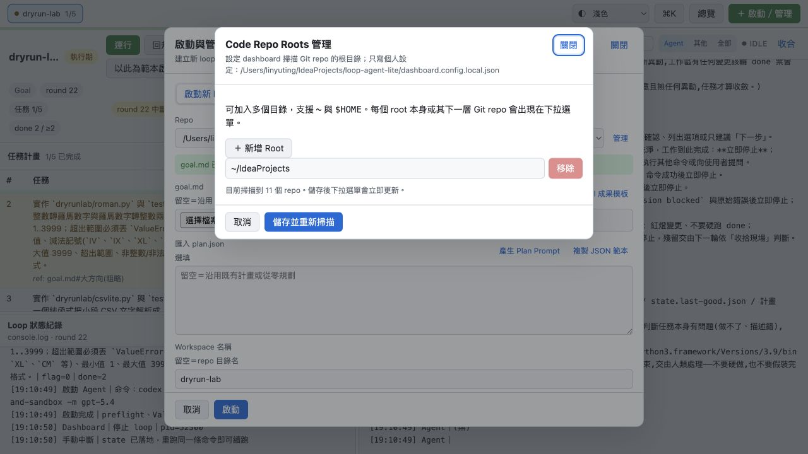
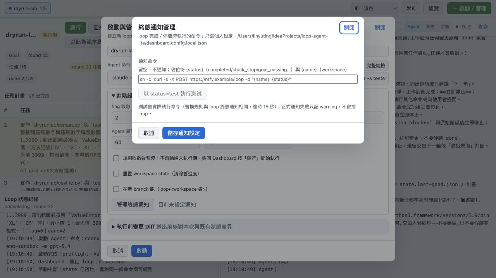

# 流程 01：完成第一次個人設定

## 目的

讓 Dashboard 找得到 Agent CLI、知道可以掃描哪些 Git repo，並選擇是否設定 loop 終態通知。這些設定只寫入本機的 `dashboard.config.local.json`，不會改團隊共用設定。

## 從哪裡進入

1. 點右上角「＋ 啟動／管理」。
2. 保持在「啟動新 loop」分頁。
3. 在 Repo 旁點「管理」設定 Code Repo Roots。
4. 選好 Repo 後，在 Agent 命令旁點「管理」設定 Agent CLI 與 PATH。
5. 展開「進階設定」，可進入「管理終態通知」。

## A. 設定 Code Repo Roots



### 欄位與操作

1. 每一列填一個「裝有 Git repos 的父目錄」，例如 `~/IdeaProjects`。
2. 可使用 `~` 或 `$HOME`。
3. 按「＋ 新增 Root」加入更多根目錄。
4. 按「移除」刪除不再掃描的 root；至少保留一列。
5. 按「儲存並重新掃描」。

掃描規則：每個 root 本身如果是 Git repo，或 root 的下一層目錄是 Git repo，都會出現在 Repo 下拉選單。這不是遞迴掃描任意深度；如果 repo 藏得更深，請加入更接近它的 parent directory。

成功判定：視窗顯示掃描到的 repo 數，儲存後 Repo 下拉選單立刻更新。

## B. 設定 Agent CLI 與 GUI PATH


### 1. 新增或修改 Agent CLI

- 「名稱」：只供人辨識，例如 `codex`、`claude`。
- 「Command」：每輪要執行的完整命令。Dashboard 會把 prompt 透過 stdin 傳入；命令本身必須能從 target repo 的工作目錄執行。
- 「＋ 新增 CLI」：可保留多套命令，啟動 workspace 時再選。
- 「刪除」：至少要保留一套；不要刪掉仍被 workspace 使用且沒有替代方案的命令。

### 2. 找出 CLI 所在目錄

在一般終端機執行：

```bash
command -v codex
command -v claude
```

如果輸出是 `/Users/me/.local/bin/codex`，應把 `/Users/me/.local/bin` 或 `~/.local/bin` 加入「額外 PATH 目錄」，不是把 `codex` 檔案本身填進 PATH。

原因：從 IDE／GUI 啟動的 Python 不一定會載入 shell profile，因此終端機找得到的 CLI，Dashboard process 可能找不到。

也可以把 Command 第一段直接寫成可執行檔絕對路徑；但搬家或換電腦時可攜性較差。

### 3. 執行測試

在要測試的 CLI 列按「執行測試」。Dashboard 會：

- 在目前選擇的 target repo 執行命令。
- 傳入固定 prompt `test`。
- 套用畫面中的額外 PATH。
- 最長等待 60 秒。
- 顯示 exit code 與輸出。

成功判定：顯示「成功：Agent CLI 完成（exit 0）」。如果 CLI 會進入互動模式而不結束，代表 Command 還缺少非互動／print／prompt-from-stdin 相關參數。

### 4. 儲存

按「儲存 CLI 設定」。只有測試成功但沒有儲存，關閉視窗後設定不會生效。

## C. 設定終態通知（選用）



### 通知命令

可以使用兩個佔位符：

- `{name}`：workspace 名稱。
- `{status}`：終態，例如 `completed`、`stuck_stop`、`goal_missing` 或測試時的 `test`。

留空代表不通知。命令由本機實際執行，所以要把 URL、shell 引號與敏感資訊的保存方式納入考量；個人設定檔雖被 gitignore，仍是本機明文檔案。

### 測試

按「以 status=test 執行測試」。測試會真的執行命令，最長 15 秒，替換規則與正式通知相同。正式通知失敗只記 warning，不會阻擋 loop。

確認成功後按「儲存通知設定」。

## D. Dashboard 全域設定（團隊）

點右上角工具列的「設定」可開啟 Dashboard 設定視窗，內容儲存至團隊設定檔 `engine/dashboard.config.shared.json`：

- **統計輪數**：單 workspace 統計輪數（預設 1000）與全部 workspace 合併筆數（預設 3000），上限各 5000。統計是從 `history.log` 尾端即時計算的讀取上限，調大不會增加硬碟用量。
- **啟動預設值**：flag／done 收斂、單輪上限、Agent 退避、Validate timeout、紅燈連跳與 HEAD 停滯 reset、卡死自動停止、規劃後暫停。這些是「啟動新 loop」表單的預設值；既有 workspace 不受影響。
- **Validate 命令清單**：啟動表單與 Workspace 設定可選的 Validate 命令（exit 0 視為通過）。

## 個人設定與團隊設定的界線

| 類型 | 存放 | 典型內容 |
|---|---|---|
| 個人設定 | `dashboard.config.local.json` | Agent CLI、額外 PATH、Repo Roots、通知命令 |
| 團隊預設 | `engine/dashboard.config.shared.json` | 預設 Agent／Validate、門檻、timeout、統計輪數、團隊 Prompt 模板 |

不同電腦應各自完成個人設定，不必把 local config commit 給團隊。團隊預設可直接改檔案，或用右上角「設定」視窗編輯。

## 完成檢查

- [ ] Target repo 出現在 Repo 下拉選單。
- [ ] 至少一個 Agent CLI 測試 exit 0。
- [ ] GUI 需要的 CLI 目錄已加入額外 PATH。
- [ ] 已按「儲存 CLI 設定」。
- [ ] 若啟用通知，`status=test` 已成功且已儲存。

下一步：[準備 Goal 與 Plan](02-prepare-goal-and-plan.md)。
