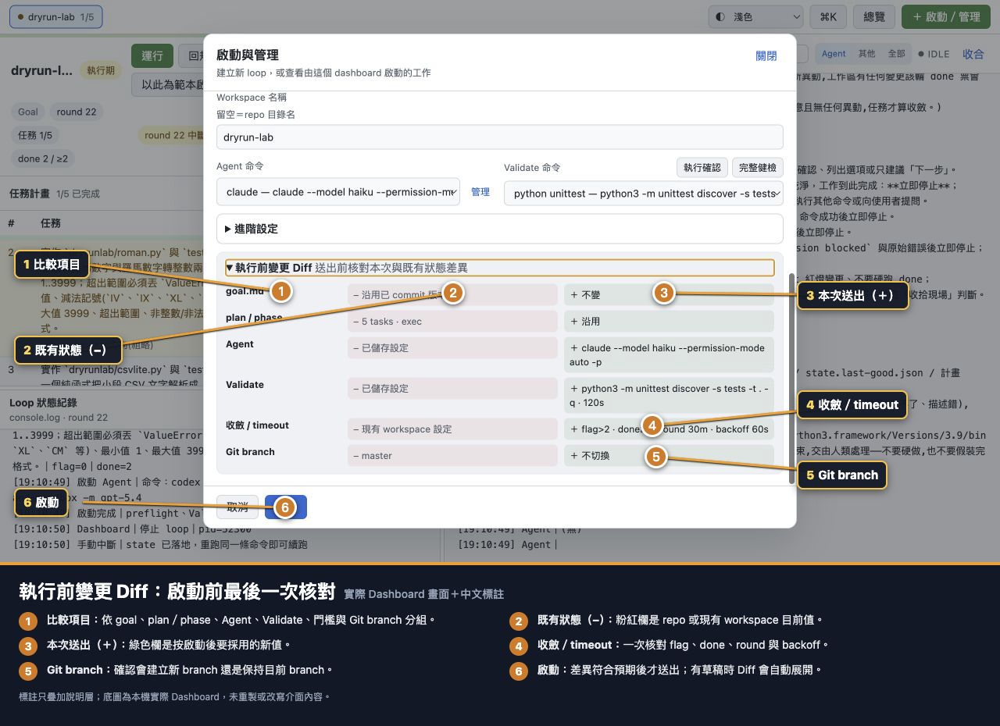

# 流程 03：啟動新的 loop

## 目的

用 Dashboard 建立一個 workspace，選擇普通 Loop 或 Parallel Loop，綁定 target repo、Goal／Plan、Agent、Validate、收斂門檻與安全選項，完成 preflight 後真正啟動。

## 前置條件

- Dashboard 已啟動。
- [個人 CLI 與 Repo Roots](01-first-time-personal-settings.md) 已設定。
- Target repo 是 Git repo。
- `goal.md` 已 commit，或普通 Loop 已準備要匯入的新 Goal；Parallel 只能使用目前 branch 已 commit 的 Goal。
- 已決定 Validate 命令，並知道它在 target repo 可執行。
- 若要使用 Parallel，已完成人工 `stack` 審查並準備非空 frozen `plan.json`。

## 進入啟動表單

點右上角「＋ 啟動／管理」→「啟動新 loop」。

## 步驟 0：選 Runner 模式

啟動表單上方先選：

| Runner | Plan 與起始階段 | 適用情境 |
|---|---|---|
| `Loop coordinator` | Plan 可留空；可從規劃期或直接執行期開始 | 需要 Agent 建立／調整計畫，或只要單一 coordinator 串行執行 |
| `Parallel Loop` | 必須匯入已凍結 Plan，固定從 exec 開始；`stack` 只能人工標註 | 已確認多個連續 tasks 可安全隔離，想讓 supervisor 管理多個原生 loop workers |
| `Ralph` | 使用 Ralph 的獨立啟動欄位 | 要使用 Ralph runner 時 |

切換 runner 只切換表單，不會啟動 process。若 Plan 還需要 Agent 審核，不要直接選 Parallel；先用普通 Loop 規劃並在收斂後暫停，離線人工補 `stack`，再回 Parallel Launcher。

## 步驟 1：選 Repo

1. 在 Repo 下拉選單選 target repo。
2. 如果沒有出現，點「管理」補 Code Repo Root，或選「手動輸入…」填絕對路徑。
3. 讀 Repo 狀態列：
   - `goal.md 已 commit`：最理想。
   - `工作樹 乾淨`：可跑一般 preflight。
   - `工作樹 髒`：一般啟動會被擋；先確認、commit 或處理變更。
   - `workspace「…」已存在`：這次不是全新名稱，需特別核對是否要沿用／重建。

Parallel 會在目前乾淨 branch 上凍結 integration 起點，再由 supervisor 建立 task branches 與 linked worktrees。不要另外手動建立多個 Dashboard writers；同 repo 已有普通或 Parallel owner 時，preflight 會拒絕新的 mutation。

## 步驟 2：決定 Goal 與 Plan

普通 `Loop coordinator`：

- `goal.md` 留空：沿用 repo 已 commit 版本；也可選擇檔案匯入新版本。
- `plan.json` 留空：沿用既有計畫，或新 workspace 從規劃期建立。
- 貼入 Plan：建立全新 state，並選「規劃期」或「直接執行期」。

`Parallel Loop`：

- `goal.md` 檔案欄停用，固定沿用目前 branch 已 commit 的版本。
- `plan.json` 必填，且必須是已人工審查的 frozen plan；相同 `stack` 只能出現在一個連續 order 區段。
- 按「產生基礎 Plan Prompt（不含 stack）」只會取得供人工排程的基礎 Plan；外部 Agent 不會替你填 `stack`。
- 貼入後讀 batch preview。看到「目前沒有可並行的 batch」表示格式合法但所有 tasks 都會依序執行。
- 起始階段固定為 exec，不會進規劃期，也不會讓 planner 重寫 `stack`。

詳細規則見 [準備 Goal 與 Plan](02-prepare-goal-and-plan.md)。

## 步驟 3：填 Workspace 名稱

留空會使用 repo 目錄名。自訂名稱只允許英數、`.`、`_`、`-`，不可是 `.`、`..`，也不可用 `.` 開頭。

Workspace 名稱識別 coordinator 資料，不會替 target repo 改名。

## 步驟 4：選 Agent 命令

選擇已測試成功的 CLI。按「管理」可編輯命令與額外 PATH。不要只看名稱；確認下拉選項後半段的完整 Command 是你預期的模型與權限模式。

## 步驟 5：選 Validate 命令

Validate 是每輪判定綠／紅的客觀門檻，例如單元測試、lint＋test 或 build。

- 「執行確認」：只在 target repo 執行這條 Validate，適合快速確認命令與依賴。
- 「完整健檢」：檢查 Git、單 writer 鎖、乾淨工作樹、Goal 與 Validate；不建立 state、不啟動 Agent。
- 「手寫…」：輸入自訂命令；輸入後再執行確認。

完整健檢在待匯入 Goal／Plan、勾 reset 或建立新 branch 時會停用，因為草稿狀態尚未落地；實際啟動仍會重新驗證。

## 步驟 6：展開進階設定

### 門檻與 timeout

- `flag 收斂（>）`：規劃期 flag 必須「大於」此值才收斂。例如填 2，要到 3 才通過。
- `done 收斂（≥）`：執行期 done 達到或超過此值才確認 task 完成。
- `單輪上限（分）`：一輪 Agent 的最長執行時間。
- `Agent 異常退避上限（秒）`：CLI 連續異常時，重試前退避的最大值。
- `Validate 上限（秒）`：單次驗證最長時間；逾時會終止 validator process group。

第一次使用建議先沿用團隊預設，除非你知道任務的典型執行時間與團隊共識策略。

Parallel 另外顯示：

- `最大並行 workers`：同一 batch 同時可執行的 worker 上限，最小 1；batch 本身仍依 order 串行。
- `Worker 重啟上限`：單一 task 遇到非預期 worker crash 時的有限恢復預算，最小 1。達上限或遇到 fatal／human gate 類阻擋時，run 會進 `blocked`，不會無限重啟。

### 三個核取方塊

- 「規劃收斂後暫停」：計畫收斂後停在執行期起點，讓人審核後再按「運行」。高風險專案建議使用。
- 「重置 workspace state」：清除舊進度重建；是重大操作，但新流程未通過 preflight 前舊 state 仍保留。
- 「在新 branch 跑」：建立 `loop/<workspace 名>` 並切換。若同時匯入 Goal，Goal 安全檢查會先於 checkout。

這三個核取方塊在 Parallel 中都停用：Parallel 已有 frozen plan 且固定從 exec 開始，不從 Launcher 重置既有普通 state，也不切換到 `loop/<workspace>`。Parallel 自己需要的 task branches／worktrees 由 supervisor 依 immutable run 建立與管理。

終態通知設定見 [第一次個人設定](01-first-time-personal-settings.md)。

## 步驟 7：讀執行前變更 Diff

每一列都要核對：

- `goal.md`：沿用、缺少、修改未 commit，或將由上傳檔取代。
- `plan / phase`：新 workspace、沿用、重建，或匯入幾個 tasks／起始階段。
- `Agent`：本次實際命令。
- `Validate`：實際命令與 timeout。
- `收斂 / timeout`：flag、done、round、backoff 與是否規劃後暫停。
- `Git branch`：保持目前 branch 或建立新 branch。

Parallel 還要回到 Plan 欄位核對 batch preview，並在進階設定核對最大 workers 與重啟上限；啟動前 Diff 不會替你證明 tasks 真的互相獨立。

粉紅色 `−` 是目前／既有值，綠色 `＋` 是這次送出值。Diff 不符合預期就回上方修改，不要先啟動再補救。

## 步驟 8：按「啟動」

啟動成功前視窗不會關閉。請看狀態訊息與 log 尾段：

- 成功：workspace 出現在上方頁籤，並開始規劃／執行。
- Preflight 失敗：不啟動 Agent；舊 state 保留。
- Validate 失敗／逾時：修正 repo、依賴、命令或 timeout 後再試。
- 單 writer 衝突：同一 Git worktree 已有 loop；先找出並停止原本的 writer。
- Parallel Plan 失敗：補齊非空 Plan、修正 `stack` 正整數或連續區段，再重新送出。
- Parallel startup／recovery 被阻擋：不要直接操作 managed worker 或 primary refs；回 base workspace 讀 error，修復可證明的 repo／process 問題後再 Resume 或 Abort。

## Parallel 啟動後怎麼看與控制

Parallel base workspace 會顯示 `Parallel` badge、run id、目前 batch、完成任務數與每個 task 的狀態。任務表欄位包括：

- `Batch`：本次 frozen plan 的 batch 編號／分組投影。
- `Outcome`：`等待`、`已整合`、`阻擋` 或 `取消`。
- `Resource`：worker 從 queued、running、gate、退出到清理的 lifecycle；`cleaned` 才表示資源已安全收完。
- `重啟`：該 task 已消耗的 worker restart 次數。
- 完成 SHA：由 base primary repo 與 receipt range 顯示 task 淨變更，即使 worker worktree 已清理仍從 base 查看。

主要控制都在 base workspace：

- `Pause`：要求 supervisor 停止派工並讓 workers 到安全邊界；已整合 commit 不回滾。`pause_requested` 可顯示「重試 Pause」。
- `Resume`：從 `paused` 或 `blocked` 先 reconcile durable state，再恢復仍允許的工作；不等於略過安全檢查的普通 Loop Resume。
- `Abort`：顯示確認預覽後取消未整合工作，保留已整合 commits，並清理可安全移除的 worktrees。Abort 後不能用普通 Resume 把已取消 task 復活。
- `重試完成收尾`／`重試取消清理`：owner 已停止但 durable terminal intent 尚未完整投影時，重播既有收尾／清理，不建立新的任務決策。
- `刪除`：只在 `completed` 或 `cancelled` 且 owner 已停止時出現；刪除 base workspace 與 durable run artifacts，不刪 target repo 或已整合 commits。

managed worker 頁面會顯示 parent、run id、assigned task、狀態、歷史與 console，但沒有 Run、Resume、Edit、Delete 或 task diff 等 mutation controls。不要繞過 parent 直接操作 worker。

## 啟動成功判定

- [ ] Workspace 頁籤出現正確名稱。
- [ ] 詳細頁顯示正確 target repo、階段與 round。
- [ ] Agent 命令與 Validate 命令在 console 開頭符合預期。
- [ ] 若勾「規劃後暫停」，規劃收斂後沒有自動跑 task，等待你按「運行」。
- [ ] 沒有 stale PID、state 錯誤、Goal 變更或未讀 issue 警示。
- [ ] 若為 Parallel，畫面顯示 `Parallel` badge、正確 run／batch，且任務表沒有意外的 `blocked` 或 `cleanup_failed`。
- [ ] 若為 Parallel，只有 base workspace 提供 Pause／Resume／Abort；managed workers 維持唯讀。
- [ ] 若為 Parallel 完成，所有 tasks 都已整合且資源為 `cleaned`，base 才進 `completed`／`phase=done` 並產生 REPORT。

下一步：[監看 Fleet 總覽](04-monitor-fleet-overview.md)。
