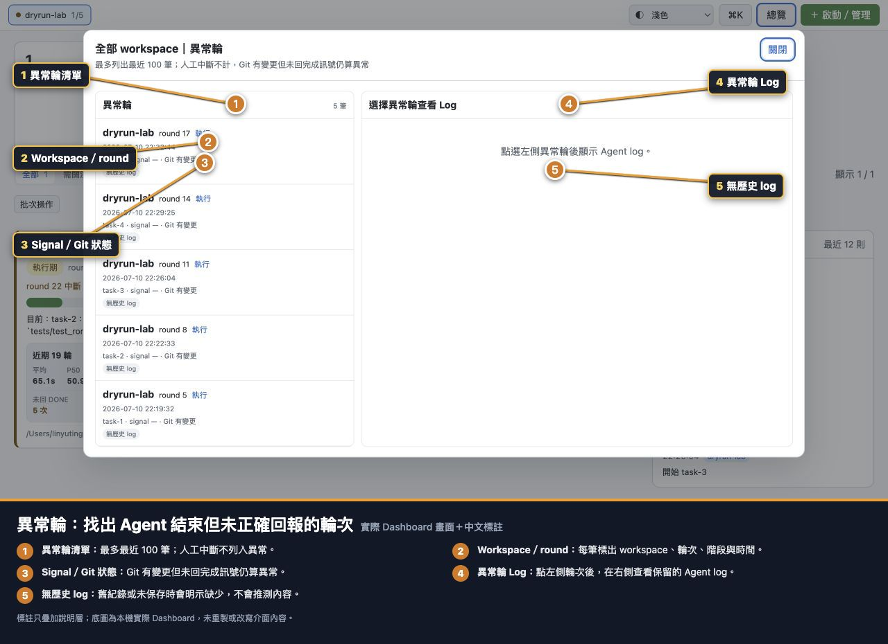
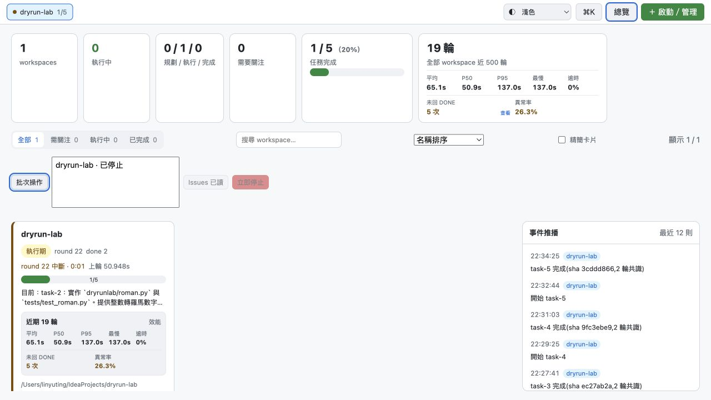

# 流程 04：用 Fleet 總覽監看所有 Workspace

## 目的

在不逐一進入 workspace 的情況下，先回答三個問題：哪些正在跑、哪些需要人處理、整體輪次是否變慢或出現未回 DONE。

## 進入方式

點右上角「總覽」，或按 `⌘K`／`Ctrl+K` 搜尋「開啟 Fleet 總覽」。

## 建議閱讀順序

### 1. 先看頂部五張摘要卡

1. `workspaces`：Dashboard 目前載入幾個 workspace。
2. `執行中`：目前正在跑 loop 的數量。
3. `規劃 / 執行 / 完成`：各階段分布。
4. `需要關注`：有未讀 issues、state 錯誤、Goal 變更、stale PID、checkpoint／Agent 異常等需要處理的 workspace。
5. `任務完成`：所有 workspace 已完成 task／總 task 與百分比。

如果「需要關注」不是 0，先按「需關注」篩選，不要只看完成百分比。

### 2. 再看跨工作區輪次效能

此卡把所有 workspace 依時間合併，取最新最多 500 個已結束輪次：

- 平均：全部樣本平均耗時，容易受極慢輪影響。
- P50：一半輪次比此值快，較接近日常體感。
- P95：95% 輪次不超過此值，用來找尾端延遲。
- 最慢：樣本中的最大耗時。
- 逾時：已知逾時輪占比。
- 未回 DONE：Agent 已結束，但沒送出該階段預期完成 signal 的輪數。
- 異常率：未回 DONE／納入統計的輪次；人工立即中斷不計。

不要把 P95 當成「95% 成功率」。它是耗時百分位。

### 3. 點「未回 DONE」看異常輪

操作：

1. 點效能卡的「未回 DONE N 次／查看」。
2. 左側選一個 workspace／round。
3. 讀階段、task、signal 與 Git 狀態。
4. 如果有保留 Agent log，右側會顯示；若顯示「無歷史 log」，代表無法回補，不要猜測內容。

Git 有變更但 Agent 沒回完成 signal 仍算異常，因為 coordinator 不能只靠檔案變更推定任務完成。

### 4. 用篩選、搜尋與排序縮小範圍

- 全部：顯示所有卡片。
- 需關注：只看有目前告警／人工待辦的 workspace。
- 執行中：只看 `running=true`。
- 已完成：只看 phase done。
- 搜尋：依 workspace 名稱過濾。
- 排序：名稱、需關注優先、執行中優先、完成度優先。
- 精簡卡片：縮小每張卡片資訊，適合大量 workspace 電視牆。

篩選選擇會保存在瀏覽器；下次覺得「卡片怎麼不見」時，先檢查目前篩選與搜尋字串。

### 5. 讀單張 Workspace 卡片

卡片通常包含：名稱、階段、round、flag／done、計時、任務進度、目前 task、近 100 輪效能、警示原因與 repo 路徑。點卡片進入詳細頁。

已完成 workspace 的歷史紅燈／停滯不會被當成目前告警；但未讀 issues、state 復原、Goal 變更、stale PID 或 state 錯誤仍可能需要關注。

### 6. 讀事件推播

右側最近事件依時間顯示任務開始、完成、規劃收斂、驗證轉紅等。點事件可切入相關 workspace。它適合快速掌握變化，不取代完整 history。

## 批次操作

1. 點「批次操作」。
2. 多選 workspace。
3. 選「Issues 已讀」或「立即停止」。
4. 讀確認預覽：不符合前置條件的項目會列為跳過，符合的項目仍會逐筆使用安全 API。
5. 確認後再送出。

批次「立即停止」是緊急操作，不是日常結束方式。

## 每日巡檢建議

- [ ] 「需要關注」是否為 0；若不是，逐項處理原因。
- [ ] 執行中數量是否符合預期。
- [ ] P95 是否突然高於平常。
- [ ] 未回 DONE 與異常率是否增加。
- [ ] 是否有同一 task 長時間沒有開始／完成事件。
- [ ] 已完成比例是否合理前進。

下一步：[監看單一 Workspace](05-monitor-workspace.md)。
