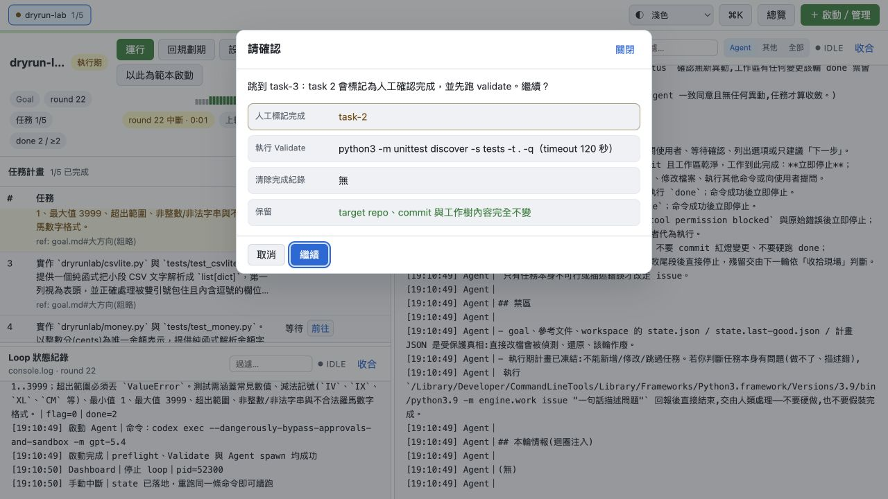

# 流程 08：編輯 Plan 與切換目前任務

## 目的

在不改寫已發生歷史的前提下，調整尚未執行的 pending tasks；或在確有人工驗證依據時，將 coordinator 切到另一個 task。

> 本流程只適用普通 Loop。Parallel base 的 plan、batch、stack 與 assignment 在啟動時已凍結，Dashboard 會拒絕 Plan 編輯、重新匯入與「前往 task」；managed worker 也全面唯讀。

## 重要前置條件

- Runner 是普通 Loop，不是 Parallel base／managed worker。
- Workspace 必須停止。
- 編輯 Plan 不等於修改 `goal.md`；任務仍必須符合 Goal。
- 已完成與目前任務會鎖定。
- 跳任務會改 coordinator 完成紀錄，必須比一般 Plan 排序更謹慎。

## A. 編輯 Pending Plan

1. 進入 workspace 詳細頁。
2. 確認按鈕顯示「運行」而不是「立即停止」。
3. 在任務計畫區按「編輯計畫」。

### 鎖定區

完成任務、目前任務，以及它們所形成的歷史前綴都不可編輯、刪除或讓 pending task 穿越。這避免重排後讓 history、完成 SHA 與 task 編號失去對應。

### 修改任務內容

每項 pending task 可改：

- 任務內容：要做什麼、範圍、限制、驗收與 DoD。
- Ref：選填，建議指向 `goal.md#章節` 或真實分析文件段落。

空白任務不能儲存。

### 排序

- 拖住 `⠿` 把手移動。
- 或用 `↑`／`↓`。
- 只能在 pending 區段移動。
- 儲存後 pending tasks 依畫面順序重新連續編號。

### 插入與刪除

- 點兩項之間的 `＋` 插入新任務。
- 點 pending task 的「刪除」移除。
- Plan 至少保留一項。
- 完成階段不能再插入。

### done 計數

右側「done 計數」是目前 task 的共識累計，不是完成 task 數。通常不要手動改；只有你明確知道 coordinator 計數需校正時才調整，並在操作紀錄留下理由。

### 送出前讀變更摘要

核對鎖定、新增、刪除、移動、文字／Ref 數量，以及「將新增／將刪除」明細。按「儲存變更」後：

- 後端在 workspace lock 內重新驗證。
- 以 plan version 防止你覆蓋剛更新的 state。
- 歷史紀錄、已完成 commit 與目前任務不改寫。

若關閉前有未儲存變更，會出現「放棄未儲存變更？」；按放棄後無法取回畫面草稿。

## B. 人工跳到後面的 Task

在任務表的等待 task 右側按「前往」。

預覽會列：

- 哪些前置 task 將被「人工標記完成」。
- 送出前要執行的 Validate 命令與 timeout。
- 哪些既有完成紀錄會被清除（若有）。
- Target repo、commit 與工作樹完全不變。

後跳不會替你實作被略過的程式碼。只有在你已人工確認那些 task 的 DoD 確實滿足，且 Validate 能通過時才可繼續。

## C. 退回前面的 Task

對較前 task 按「前往」時：

- 目標 task 及其後的完成紀錄會清除。
- Target repo code、commit 與工作樹不會自動倒退。

這代表 coordinator 會重新處理較前 task，但 Git 現場仍維持現在；Agent 必須自行判斷哪些實作已存在。若你的真正需求是把程式碼回到舊 commit，這個按鈕做不到，也不應假設它會做。

## 什麼時候選哪一個

| 需求 | 操作 |
|---|---|
| 調整未來任務順序／描述 | Plan 編輯器 |
| 在 pending tasks 間新增或刪除 | Plan 編輯器 |
| 目標或範圍根本變了 | 修改並 commit Goal，回規劃期重新收斂 |
| 已由人完整驗證某些 task，可跳過 | 前往後面的 task，讀預覽並 Validate |
| 要重新驗收先前 task | 退回 task；記得 code 不會回退 |
| 要回復 Git 程式碼 | 在 target repo 走獨立、經審核的 Git 流程，不是「前往」 |
| 要修改 Parallel task、順序或 stack | 不可修改既有 run；需要檢查現場可先 Pause，但啟動新 run 前舊 run 必須完成或 Abort 到 `cancelled`。再從原始 Plan 產生並人工審核新的 frozen plan，以新 workspace 名稱啟動 Parallel。 |

Parallel 之所以不開放 pending 區編輯，不只是 UI 限制：plan hash、batch、每個 worker assignment 與 launch spec 已互相綁定。即使 run 是 `paused`／`blocked`，也不能以 ordinary Plan Editor 繞過此契約。

## 完成檢查

- [ ] Workspace 已停止。
- [ ] 已確認是普通 Loop；Parallel 應建立新 frozen run，而非編輯現有 state。
- [ ] 沒有修改鎖定歷史。
- [ ] 每項 pending task 非空且有可驗收 DoD。
- [ ] 變更摘要符合預期。
- [ ] 若跳任務，已逐項確認人工完成依據與 Validate。
- [ ] 儲存／跳轉後重新查看任務表與 Loop 操作紀錄。

相關：[切換規劃／執行階段](09-change-phase.md)。
