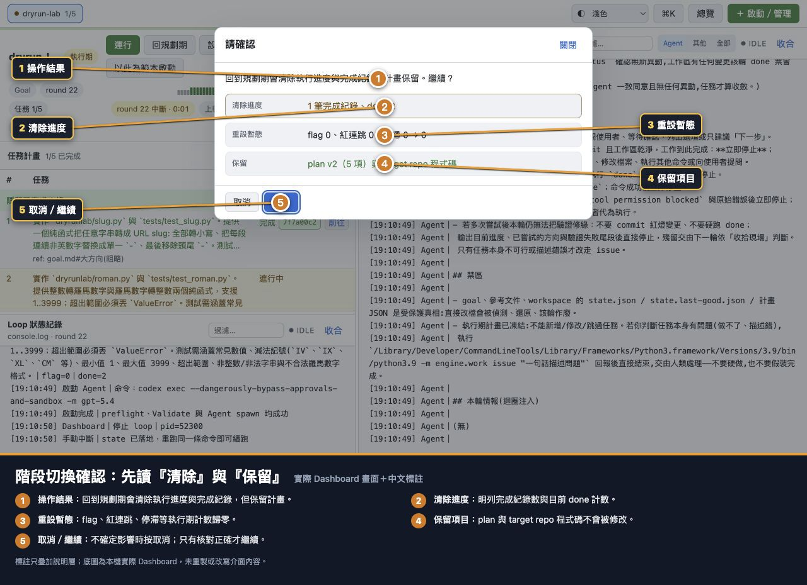

# 流程 09：切換規劃期與執行期

## 目的

在人工判斷計畫已可執行時直接進執行期，或在 Goal／Plan 需要重新收斂時回規劃期。階段切換會重設 coordinator 計數，因此必須先讀影響預覽。

> 本流程只適用普通 Loop。Parallel 固定以人工審核的 frozen plan 從 exec 啟動，不提供 plan ↔ exec 階段切換；managed worker 也不可切 phase。

## 前置條件

- Runner 是普通 Loop，不是 Parallel base／managed worker。
- Workspace 已停止。
- 進執行期前 Plan 至少有一項。
- 已理解階段切換只改 coordinator state，不會自動改 target repo 程式碼。

## A. 規劃期 → 執行期

1. 確認 Plan 已由人審核，task-1 可直接動工。
2. 按「進執行期」。
3. 在確認視窗核對：
   - 開始任務：plan 的第一項。
   - 重設暫態：flag、done、紅連跳、停滯歸零。
   - 保留：目前 plan version 與 target repo 程式碼。
4. 確認後 workspace 停在執行期起點；按「運行」開始，並優先選一般執行。

適用：你已匯入／人工審核 Plan，不需要再由規劃 Agent 累積 flag 共識。

不適用：Plan 還有不確定範圍、相依順序、DoD 或人工決策。

## B. 執行期／完成 → 規劃期

按「回規劃期」後會看到：

預覽的三類資訊：

- 清除進度：已完成任務紀錄與 done 計數。
- 重設暫態：flag、紅連跳、停滯歸零。
- 保留：Plan 與 target repo 程式碼。

特別注意：完成紀錄清除不會刪 commit，也不會把程式碼退回。新的規劃／執行輪會在現有 repo 現場上重新判斷。

## 什麼時候應回規劃期

- `goal.md` 已變更。
- Agent 回報 task 本身不可行或描述錯誤。
- Plan 依賴順序錯誤，不能只調 pending 區段解決。
- 規格新增／刪除重大範圍。
- 完成後要以同一 workspace 對新 Goal 重新規劃，且接受清除舊完成進度。

## 什麼時候不要回規劃期

- 只是 Agent CLI 暫時失敗：修 CLI／PATH 後一般執行。
- 只是 Validate 命令寫錯：用 Workspace 設定修正。
- 只是需要重跑目前 task：停止後一般執行即可。
- 只想調整未來 pending tasks：用 Plan 編輯器。
- 想讓 Git code 回到舊版本：階段切換不會做 Git rollback。
- Parallel run：不要把 base 投影的 `exec/done` 當成可人工切換的 phase。要暫停或續跑用 Pause／Resume；Goal／Plan 要重做則 Abort，commit 新真相後啟動新的 Parallel run。

## Parallel 的 phase 為何不能切

Parallel planner 不會在 run 內建立或改寫 stack。Launcher 先凍結 plan／batch／assignment，supervisor 才固定從 exec 派工；只有 durable status 到 `completed` 時 base 才投影為 phase `done`。`paused`、`blocked`、`cancelled` 等判讀都以 Parallel status 為準，不能用 ordinary phase API 重設。

## 切換後檢查

- [ ] Phase badge 已變成預期階段。
- [ ] 已確認是普通 Loop；Parallel 應核對 durable run status。
- [ ] flag／done 與暫態計數已按預覽重設。
- [ ] Plan 仍是預期版本與項目數。
- [ ] Target repo HEAD／工作樹沒有被 Dashboard 階段切換改動。
- [ ] Loop 狀態紀錄有 Dashboard 人工操作稽核行。
- [ ] 下一次「運行」前已決定一般執行或 Resume；通常用一般執行。

相關：[Workspace 設定與 Plan 轉移](10-workspace-settings-and-plan-transfer.md)。
