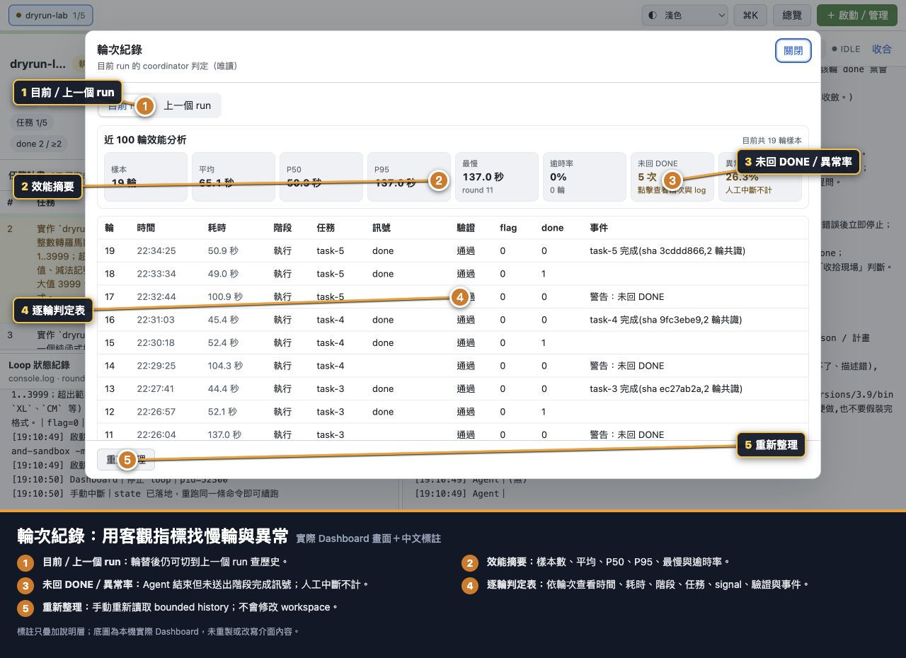
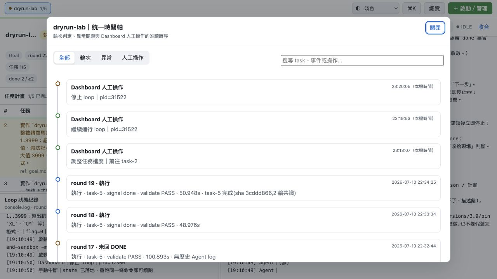
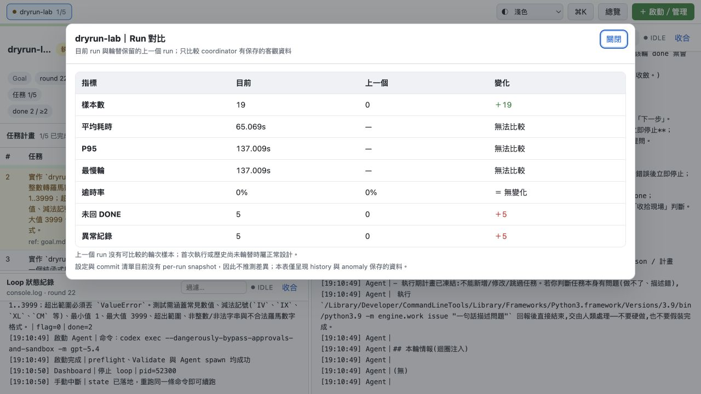
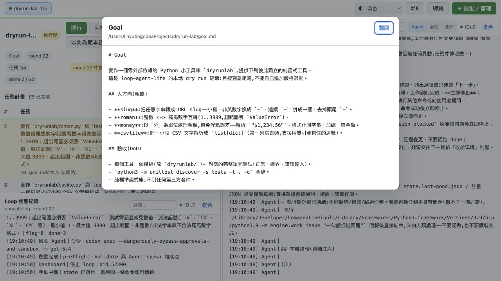
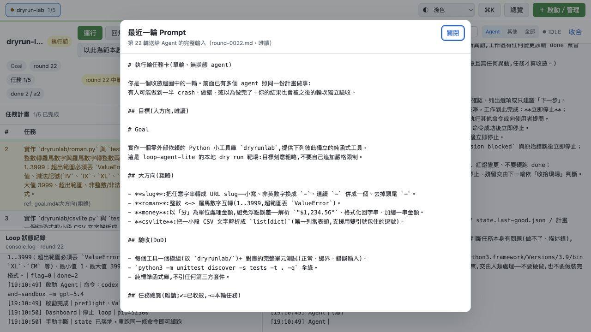

# 流程 11：查看歷程、異常、Run 對比與 Git Diff

## 目的

用 coordinator 保存的客觀資料回答：哪一輪變慢／失敗、Agent 是否漏回完成訊號、人工做過什麼操作、這次 run 是否退步，以及每個 task 實際改了哪些程式碼。

## A. 輪次紀錄

在 workspace 狀態列點「輪次紀錄」。

### 摘要指標

- 樣本：目前 run 最近最多 100 個已結束輪次。
- 平均：所有樣本平均耗時。
- P50：中位附近耗時。
- P95：尾端慢輪門檻；95% 樣本不超過它。
- 最慢：最大耗時與 round。
- 逾時率：history 中 timeout 輪比例。
- 未回 DONE：Agent 結束但沒有階段預期 signal。
- 異常率：未回 DONE／樣本；人工立即中斷不計。

可切「目前 run」與「上一個 run」。首次執行或尚未輪替時，上一個 run 沒有樣本是正常的。

### 逐輪欄位

| 欄位 | 用途 |
|---|---|
| 輪 | round 編號 |
| 時間 | 輪次時間 |
| 耗時 | Agent／輪判定保存的秒數 |
| 階段 | 規劃或執行 |
| 任務 | 執行期 task-N |
| 訊號 | `create-plan`、`plan-ok`、`done` 等 |
| 驗證 | PASS、FAIL 或不適用 |
| flag／done | 該輪結束的共識計數 |
| 事件 | 任務完成 SHA、規劃收斂、未回 DONE 等 |

## B. 異常輪與保存 Log

在輪次紀錄的「未回 DONE」或 Fleet 效能卡點入：

判定原則：Plan 期預期 `create-plan`／`plan-ok`，Exec 期預期 `done`。即使 Git 有變更，沒 signal 仍算異常；coordinator 不用「有改 code」猜完成。

新發生的異常可保存 Agent log 尾段；舊資料若顯示「無歷史 log」，只能依 history、commit 與其他 log 查證，畫面不會虛構內容。

## C. 統一時間軸

點「時間軸」：

它把三種資料放在一條時序：

- 歷史輪次判定。
- 異常關聯。
- Dashboard 人工操作，例如停止、Resume、Validate、編輯 Plan、切換 task。

只有時間、沒有日期的 console 記錄會明示「本機時間」，避免把推定時間當成精確事實。時間軸用來重建事件順序，不會修改 state。

## D. Run 對比

點「⇄ Run 對比」：

比較目前與上一個 run 的：樣本數、平均、P95、最慢、逾時率、未回 DONE、異常紀錄。耗時與異常越低通常越好；樣本數只是資料量，不直接代表品質。

重要限制：設定與 commit 清單沒有 per-run snapshot，所以畫面不推測「哪個設定改了」或「哪些 commit 不同」。看到指標退步後，應再查時間軸、人工操作與 Git history。

## E. Goal 與 Prompt 稽核

`Goal` 顯示目前目標：

`Prompt` 顯示最近一輪實際送入 Agent 的完整 prompt：

用法：當 Agent 行為與預期不同，先確認它實際收到的 Goal、task、步驟、禁區與本輪注入情報。不要只依 UI 上縮短的 task 摘要猜 prompt。

## F. 完成 Task 的 Git Diff

1. 在任務表按「顯示已完成 N 條」。
2. 點完成 task 右側 SHA。

### 上方資訊

- Task 描述：確認差異屬於哪個工作單位。
- 起點 → 完成 SHA：新版 state 在 task 開始時固化 base SHA，顯示整個 task 的淨變更。
- Commit 數與檔案數。
- `+N / -N`：新增與刪除行數。
- 「這個 task 包含 N 個 commit」可展開 commit 清單。

舊 state 沒有 task base SHA 時，會退回前一 task SHA 或只顯示完成 commit，並明示相容模式；不要把它誤認為完整淨變更。

### 左側檔案清單

- A：新增。
- M：修改。
- D：刪除。
- 可搜尋路徑。
- 每檔顯示增刪行數。

### 右側 Diff

- 並排：舊／新兩欄，適合修改比較。
- 單欄：unified view，窄畫面較清楚。
- 自動換行：長行不水平捲動。
- 綠色新增、紅色刪除。
- Binary 或過大 patch 不會強行當文字展開。

## 建議調查流程

1. 從 Fleet 找異常 workspace。
2. 進輪次紀錄找 round 與指標。
3. 點異常輪看保存 log。
4. 用時間軸對齊 Dashboard 人工操作。
5. 開 Prompt 確認 Agent 實際收到什麼。
6. 若 task 已完成，從 SHA 看 Git Diff 與 commit。
7. 必要時在 target repo 重跑 Validate；不要用畫面摘要取代實際驗證。

下一步：若異常是 Agent 要求人決策，請看 [Issues 與人工介入](12-issues-and-human-intervention.md)。
