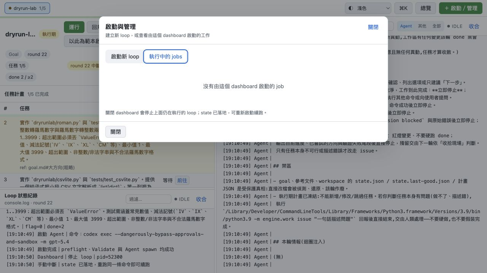

# 流程 13：從範本啟動與查看 Dashboard Jobs

## 目的

快速用現有 workspace 的成熟設定建立另一個 workspace，或查 Dashboard 啟動過的 background jobs 與輸出尾段。

## A. 以目前 Workspace 為範本啟動

### 可預填的內容

在詳細頁按「以此為範本啟動」後，啟動表單會預填：

- Target repo。
- Agent 命令。
- Validate 命令。
- flag／done 門檻。
- round、backoff、Validate timeout。
- reset 防線與規劃後暫停等 workspace config。

執行中、停止或完成的 workspace 都可當範本；只要 state 有 config 區塊。

### 刻意不預填的內容

Workspace 名稱留空，避免誤覆寫原 workspace。你必須填新名稱或明確接受 repo 目錄名。

範本不是 clone state：不複製 round、completed、done／flag、issues、history、logs 或完成 SHA。新啟動仍走完整表單驗證與 preflight。

### 操作步驟

1. 在來源 workspace 核對 Agent、Validate 與門檻確實適合作為範本。
2. 按「以此為範本啟動」。
3. 填新的 Workspace 名稱。
4. 決定 Goal 與 Plan：沿用同 repo、上傳新 Goal，或匯入新 Plan。
5. 核對 branch 選項，避免兩個 workspace 使用同一 Git worktree 同時跑。
6. 逐列讀「執行前變更 Diff」。
7. 按啟動，等待 preflight 成功。

如果要並行，必須使用不同 Git worktree；不同 workspace 名稱不能解除同 worktree 的單 writer 限制。

## B. 查看「執行中的 jobs」

點「＋ 啟動／管理」→「執行中的 jobs」。

每張 job 卡顯示：

- Workspace 名稱。
- PID。
- `執行中` 或 `已結束 rc=N`。
- Target repo 路徑。
- 輸出尾段。
- 活躍 job 的「停止」按鈕。

清單每 2 秒更新。Dashboard 保留最近 50 個已結束 job 的尾段供稽核；更早的已結束 job 自動淘汰，活躍 job 不受此限制。淘汰 job 卡片不會刪 workspace state 或 history。

## 關閉 Dashboard 的影響

關閉 Dashboard process 會停止由它管理、仍在執行的 loop；state 會落地，可重新啟動後續跑。不要只關瀏覽器 tab 就假定 Python process 已停止；真正管理 loop 的是後端 process。

## Job 停止與 Workspace 停止

- Job 卡「停止」會呼叫 workspace 的立即停止 API。
- 日常停止仍建議回 workspace 詳細頁用「本輪後停止」。
- Job 已結束但 workspace phase 尚未 done 很正常，表示 process 停止、協調任務未完成。

## 完成檢查

- [ ] 新 workspace 使用新的明確名稱。
- [ ] 範本只複製 config，沒有誤認會複製進度。
- [ ] 同一 Git worktree 沒有兩個 writer。
- [ ] 執行前 Diff 已核對 Goal、Plan、Agent、Validate、門檻與 branch。
- [ ] Job 狀態與 workspace phase 分開判讀。

相關：[啟動新的 loop](03-launch-new-loop.md)。
