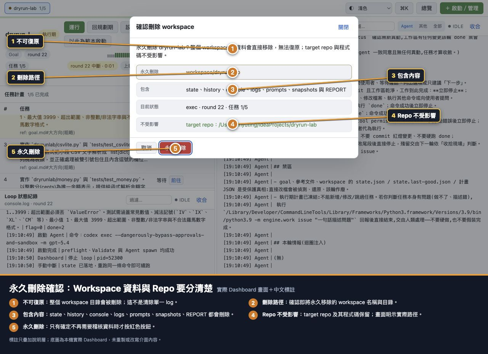

# 流程 14：永久刪除 Workspace

## 目的

永久移除不再需要的 workspace coordinator 資料，同時清楚確認 target repo 與程式碼不受影響。

## 刪除前提

- Workspace 必須停止。
- 執行中、鎖定中或 workspace 路徑是 symlink 時，後端會拒絕。
- 刪除無法復原。
- 如果還需要稽核或移轉，先備份／匯出。

## 刪除前備份清單

依需求保存：

- 從設定匯出純 `plan.json`。
- `REPORT.md`。
- `history.log` 與 `console.log`。
- `logs/`、`prompts/`、`snapshots/`。
- 目前 workspace 設定的截圖或紀錄。

Target repo Git commit 本身不會因刪 workspace 消失，但 workspace 專屬的 coordinator 關聯與 log 會消失。

## 操作步驟

1. 用「本輪後停止」並等到 workspace idle。
2. 在詳細頁按紅色「刪除」。
3. 逐列閱讀確認視窗。

### 確認視窗必查四件事

1. Workspace 名稱與刪除目錄正確。
2. 包含內容符合預期：state、history、console、logs、prompts、snapshots、REPORT。
3. 目前 phase、round、任務進度不是仍需要保留的狀態。
4. 「不受影響」列出的 target repo 路徑正確。

4. 不確定就按「取消」。
5. 確認不再需要稽核資料才按「永久刪除」。

## 技術上的安全邊界

刪除會先把 workspace root entry 原子改成隱藏暫存名稱，再以不跟隨 symlink 的方式移除整棵目錄；不會沿 symlink 刪到 workspace 外。後端仍以實際 workspace root 為邊界驗證。

## 刪除後會怎樣

- Workspace 頁籤與 Fleet 卡片消失。
- `workspace/<name>/` 的協調資料永久移除。
- Target repo 目錄、Git branch、commit、程式碼與工作樹保留原樣。
- 若要再用同名 workspace，需從「啟動／管理」重新建立新 state。

## 不該用刪除解決的問題

| 問題 | 正確操作 |
|---|---|
| 只想清除未讀 issues | 標記已讀；通常不要清空 |
| 只想重新規劃 | 回規劃期 |
| 只想換 Agent／Validate | Workspace 設定 |
| 只想換 Plan 並重置進度 | 匯入 Plan 並完整重置 |
| 只想停止 process | 本輪後停止／立即停止 |
| 想刪 target repo | Dashboard workspace 刪除不會做；走獨立 repo 管理流程 |

## 完成檢查

- [ ] Workspace 已停止。
- [ ] 已保存所有需要的 Plan、REPORT 與 log。
- [ ] 確認視窗的 workspace 與 target repo 路徑已核對。
- [ ] 理解 target repo 保留、workspace 稽核資料刪除。
- [ ] 刪除後 Fleet 與頁籤已更新。

回到：[文件首頁](README.md)。
