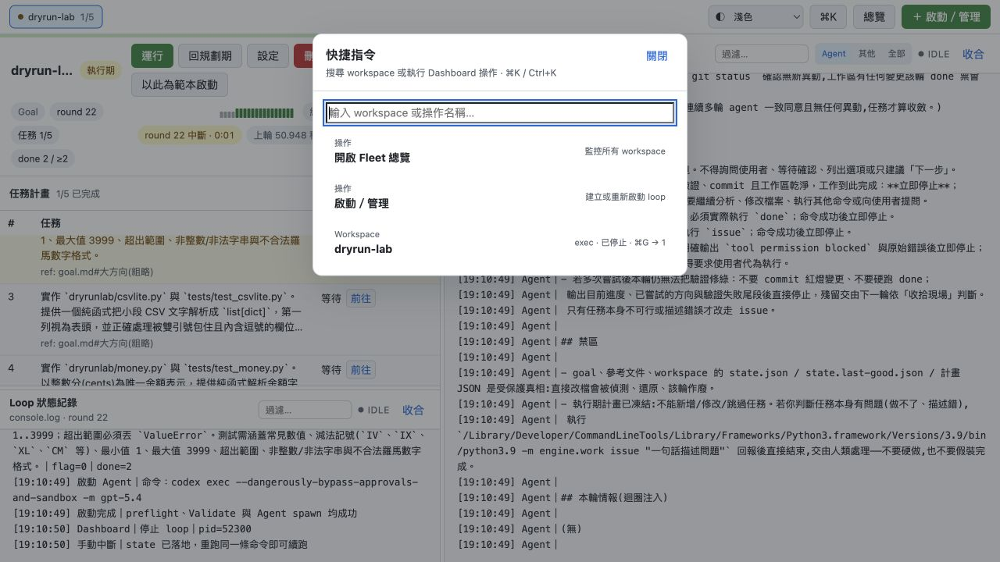

# 流程 15：快捷鍵、主題與版面操作

## 目的

在 workspace 多、log 長或只用鍵盤時快速切換畫面，同時知道哪些版面設定只影響瀏覽器顯示、不會改 loop state。

## A. 快捷指令面板

按 `⌘K`（macOS）或 `Ctrl+K`（其他平台），或點上方「⌘K」。

可搜尋：

- 開啟 Fleet 總覽。
- 啟動／管理。
- Workspace 名稱。

用方向鍵移動、Enter 執行、Esc 關閉。對話框會鎖住焦點；關閉後焦點回到原操作位置。

## B. 快速切 Workspace

按 `Ctrl+G`（macOS 為 `⌘G`），再於 1.5 秒內按：

- `0`：Fleet 總覽。
- `1`～`5`：前五個 workspace。

輸入框、textarea、select、可編輯內容或對話框開啟時不觸發，避免你打字時意外切頁。

## C. Workspace 頁籤

頂部每個 tab 顯示：

- 狀態點。
- Workspace 名稱。
- 規劃期可能顯示 flag、執行期顯示任務完成比、完成顯示完成。

點 tab 不會啟動／停止 loop，只切換詳細頁。

## D. 主題

「介面主題」可選：

- 跟隨系統。
- 深色。
- 淺色。

主題只保存在瀏覽器，與 workspace 設定、Agent prompt、截圖中的 target repo 無關。

## E. 調整版面

- 拖水平分隔線：改任務表與 Loop 狀態紀錄的高度。
- 拖垂直分隔線：改左側任務／狀態與右側 Agent console 欄寬。
- 點 console「收合」：隱藏該 pane。
- 點已收合標題：展開。
- 勾 Fleet「精簡卡片」：縮小 workspace 卡片。

這些選擇保存在瀏覽器 local storage；換瀏覽器／清除網站資料後可能回預設。

## F. 瀏覽器分頁狀態

Tab title 與 favicon 可在背景監看：

- 綠：執行中／健康。
- 紅：警告。
- 藍：完成。
- 灰：已停止。

實際可見字樣會顯示執行中、警告、完成或已停止。這是快速提示；最終判斷仍看 Fleet／workspace 詳細狀態。

## G. 可及性操作

- 頁首有「跳到主要內容」。
- 鍵盤 focus outline 清楚可見。
- Modal 有 focus trap、Esc 關閉與焦點回復。
- 支援 reduced-motion 與 forced-colors。
- 所有重要圖示／狀態有可讀標籤，不應只靠顏色判斷。

## 快捷操作表

| 操作 | macOS | 其他平台 |
|---|---|---|
| 開快捷指令 | `⌘K` | `Ctrl+K` |
| 啟動快速切換前綴 | `⌘G` | `Ctrl+G` |
| 回總覽 | `⌘G` → `0` | `Ctrl+G` → `0` |
| 切前五個 workspace | `⌘G` → `1..5` | `Ctrl+G` → `1..5` |
| 關閉目前對話框 | `Esc` | `Esc` |

回到：[文件首頁](README.md)。
