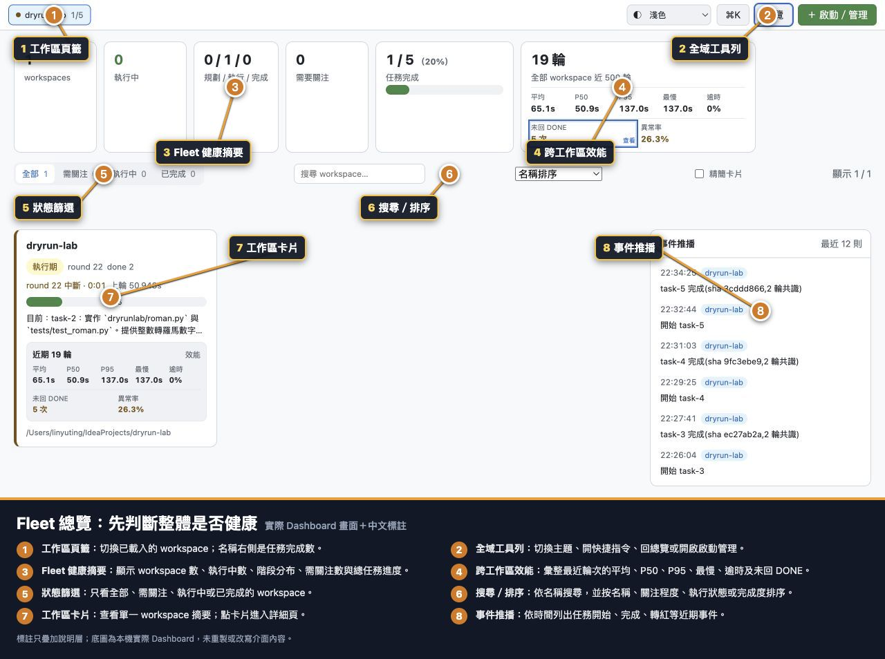
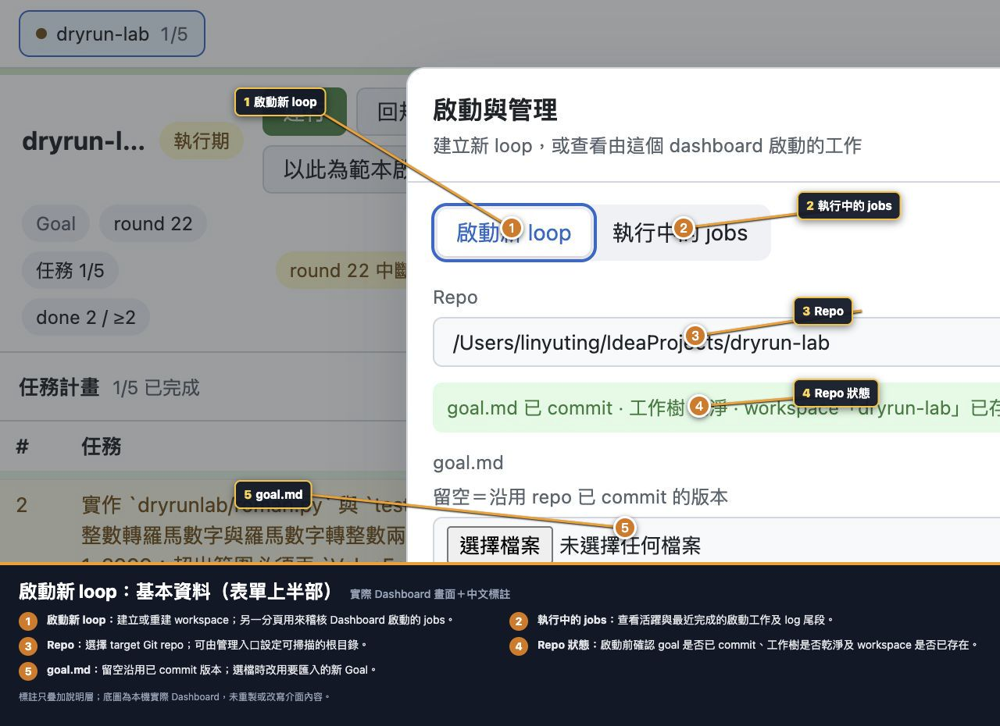
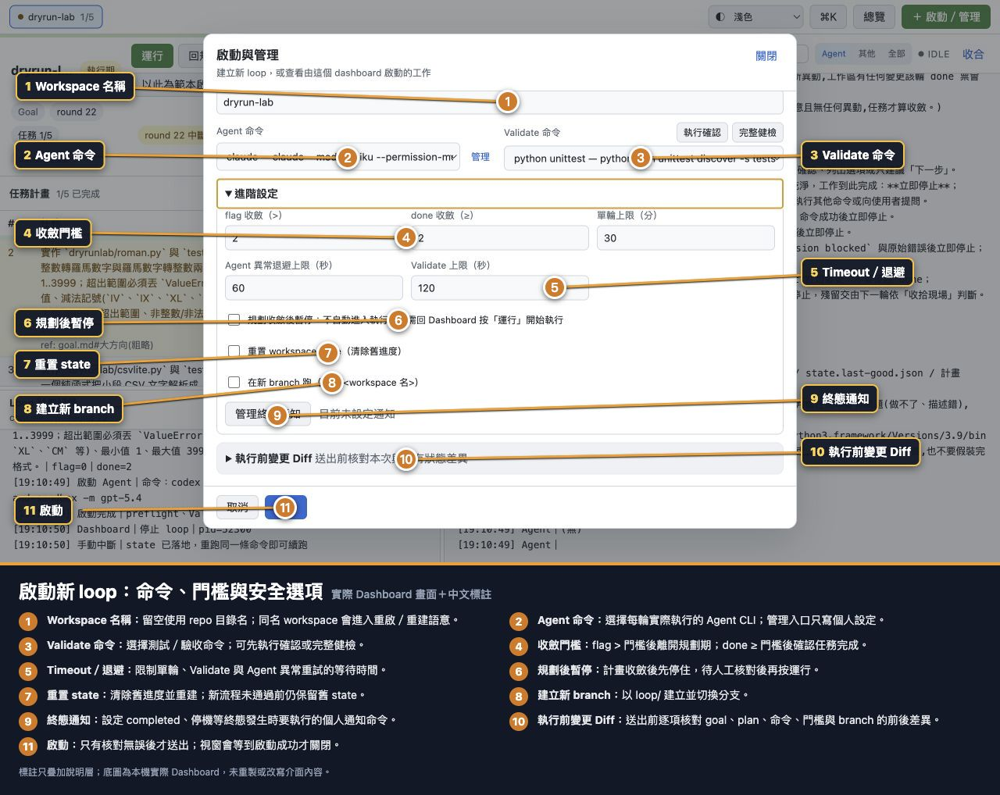
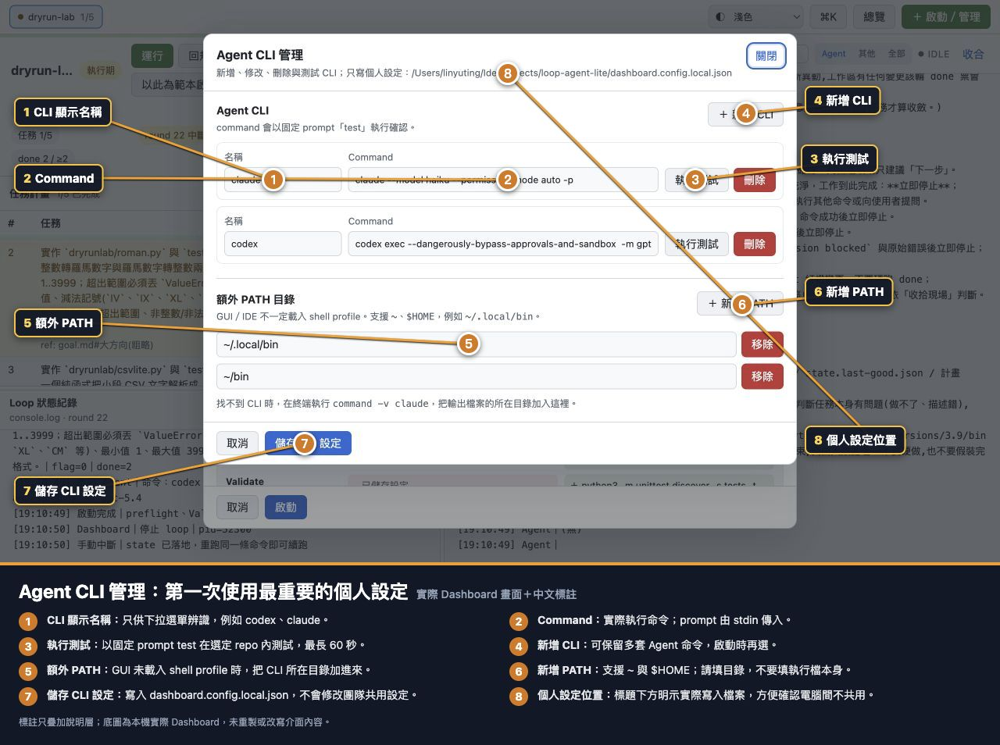
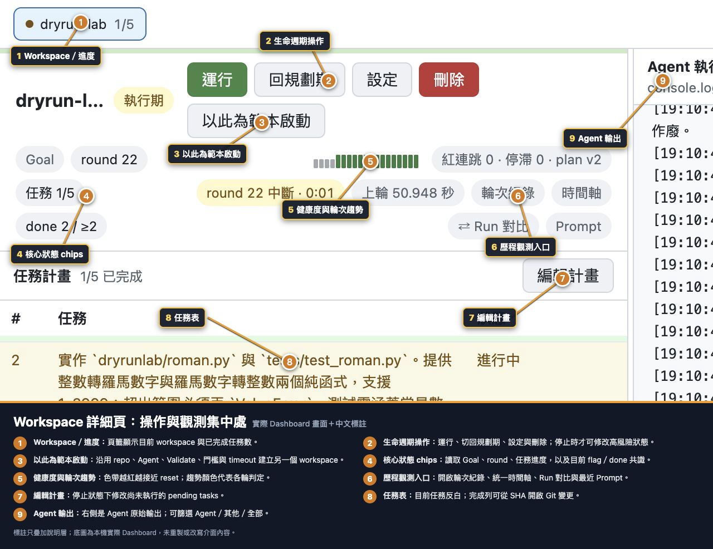
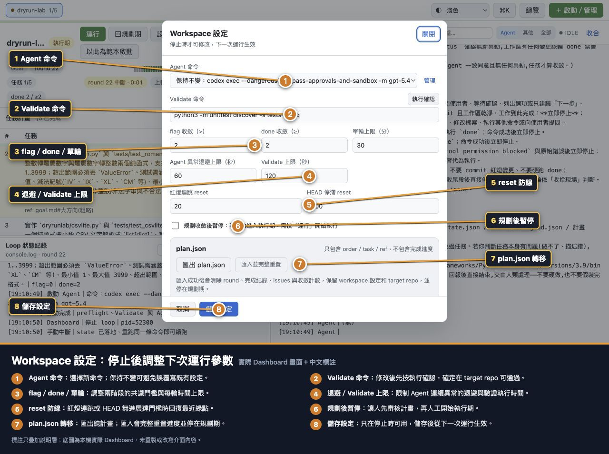
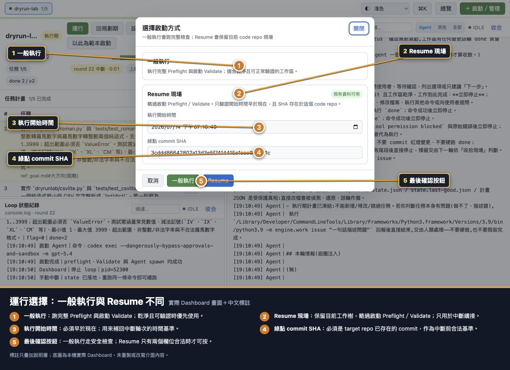
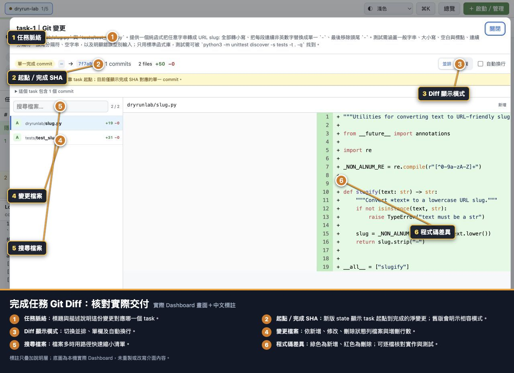

# Dashboard 欄位與控制項完整說明

這是「欄位字典」：依畫面逐一說明用途、設計意圖、何時可用與副作用。第一次操作流程請先從 [文件首頁](README.md) 開始；遇到不熟悉欄位再回來查。

## 1. 全域頁首

| 欄位／控制項 | 用途與設計意圖 | 注意事項 |
|---|---|---|
| Workspace 頁籤 | 快速切換已載入 workspace，附狀態點與進度摘要 | 只切畫面，不會啟動／停止 |
| 介面主題 | 跟隨系統、深色、淺色 | 只保存在瀏覽器 |
| `⌘K` | 開快捷指令，搜尋 workspace／全域操作 | Windows／Linux 用 `Ctrl+K` |
| 總覽 | 切到 Fleet 電視牆 | 按下狀態表示目前在總覽 |
| ＋ 啟動／管理 | 新建／重建 loop，或查看 Dashboard jobs | 打開表單本身不會啟動 |
| 工作區需處理（條件式） | 有問題時直達「需關注」篩選 | 只有真的有問題才顯示 |

## 2. Fleet 總覽

### 頂部統計

| 欄位 | 意義 | 如何使用 |
|---|---|---|
| workspaces | 載入的 workspace 數 | 確認掃描／資料數量是否符合預期 |
| 執行中 | `running=true` 的 loop 數 | 不等同 exec phase 數 |
| 規劃／執行／完成 | phase 分布 | 觀察整體流程位置 |
| 需要關注 | 有目前健康問題或未讀人工待辦的數量 | 非 0 時先篩「需關注」 |
| 任務完成 | 所有 workspace completed task／總 task | 顯示百分比與 progress bar |

### 輪次效能

| 欄位 | 意義 | 讀法 |
|---|---|---|
| N 輪 | 所有 workspace 依時間合併的最新樣本，上限依 Dashboard 設定（預設 3000） | 只含已結束輪 |
| 平均 | 算術平均耗時 | 易受極慢輪影響 |
| P50 | 50th percentile | 接近日常中位體感 |
| P95 | 95th percentile | 找尾端慢輪，不是成功率 |
| 最慢 | 最大耗時 | 搭配 history 找 round |
| 逾時 | timeout 輪比例 | 人工中斷與逾時不同 |
| 未回 DONE | Agent 結束但沒有階段預期 signal | 點「查看」開異常清單 |
| 異常率 | 未回 DONE／有效樣本 | 人工立即中斷不計 |

### 篩選與卡片

| 控制項 | 用途 | 注意事項 |
|---|---|---|
| 全部 | 顯示所有卡片 | 預設視圖 |
| 需關注 | 未讀 issues、state／Goal／PID／Agent 等目前問題 | 完成 workspace 的歷史紅燈不誤報 |
| 執行中 | 只看正在跑的 process | 與 exec phase 不同 |
| 已完成 | 只看 phase done | 仍可能有持續性告警 |
| 搜尋 workspace | 依名稱過濾 | 會與狀態篩選一起作用 |
| Workspace 排序 | 名稱、需關注、執行中、完成度優先 | 不改任何 state |
| 精簡卡片 | 縮小卡片資訊 | 適合大量 workspace |
| 顯示 X/Y | 目前過濾結果／總數 | 找不到卡片先查這裡 |
| 批次操作 | 多選後標 issues 已讀或立即停止 | 確認預覽會列可執行／跳過 |
| Workspace 卡片 | 名稱、phase、round、done／flag、計時、task、效能、repo | 點卡片進詳細頁 |
| 事件推播 | 最近 12 則重要事件 | 快速提示，不取代 history |

## 3. 啟動與管理：基本欄位

| 欄位／按鈕 | 是否必填 | 用途與用意 | 格式／注意事項 |
|---|---:|---|---|
| 啟動新 loop | — | 顯示啟動表單 | 與 jobs 分頁分開 |
| 執行中的 jobs | — | 看由 Dashboard 啟動的 process 與尾段 | 不代表 phase |
| Repo | 是 | Target Git repo | 來自 Repo Roots 或手動路徑 |
| 管理 Code Repo Roots | — | 設定掃描 parent directories | 寫個人設定 |
| 手動輸入 Repo | 條件式 | 下拉沒有時填路徑 | 建議絕對路徑 |
| Repo 狀態 | 唯讀 | 顯示 Goal Git 狀態、工作樹、branch、既有 workspace | dirty tree 會擋一般 preflight |
| goal.md 檔案 | 否 | 上傳要取代／匯入的 Goal | 留空沿用 repo 已 commit 版本 |
| Goal 產生器 Prompt | — | 建構交給外部 Agent 的 Goal 撰寫 prompt；可勾選同時產生初版 plan.json | 只在瀏覽器，不寫 repo |
| Goal 成果模板 | — | 顯示符合契約的 Goal 骨架 | 仍需人工適配 |
| 匯入 plan.json | 否 | 建立全新純 Plan state | 留空沿用或從零規劃 |
| 產生 Plan Prompt | — | 產生要求外部 Agent 輸出 Plan JSON 的 prompt | 輸出仍需審查 |
| 複製 JSON 範本 | — | 複製合法 schema 範例 | Clipboard 失敗時可能填入 textarea |
| 起始規劃期 | 條件式 | 匯入 Plan 後仍讓規劃輪審核 | 只有 Plan 合法時顯示 |
| 直接執行期 | 條件式 | 匯入 Plan 後從 task-1 執行 | Plan 應先人工審核 |
| Workspace 名稱 | 否 | Coordinator 資料識別 | 留空＝repo 目錄名；只允許英數 `._-` 等合法規則 |
| Agent 命令 | 是 | 每輪實際執行的 CLI | Prompt 由 stdin 傳入 |
| 管理 Agent CLI | — | 編輯 CLI 與額外 PATH | 寫個人設定 |
| Validate 命令 | 是 | 每輪綠紅與 DoD 客觀檢查 | 可選預設或手寫 |
| 執行確認 | — | 只執行目前 Validate | 不建立 state、不啟動 Agent |
| 完整健檢 | — | Git、鎖、乾淨樹、Goal、Validate | 有未落地草稿 mutation 時停用 |
| 自訂 Validate | 條件式 | 手寫命令 | 不可空白；應先確認 |

### Plan JSON 欄位

| JSON 欄位 | 必填 | 用途 | 規則 |
|---|---:|---|---|
| `order` | 是 | 任務順序 | int、唯一、從 1 連續 |
| `task` | 是 | 無前後文也能執行的任務描述 | 非空字串，應含 DoD |
| `ref` | 否 | 連到 Goal／分析段落 | 字串、`null` 或省略 |

未知欄位、整份 state、完成狀態與 SHA 會被拒絕。

## 4. 啟動與管理：進階欄位

| 欄位 | 最小值 | 判定／用途 | 設計意圖 |
|---|---:|---|---|
| flag 收斂（>） | 1 | `flag > value` 才離開規劃期 | 多輪獨立確認計畫 |
| done 收斂（≥） | 1 | `done >= value` 才完成 task | 避免單輪自我宣告完成 |
| 單輪上限（分） | 0 | Agent round timeout | 限制卡住輪；0 的語意依後端設定驗證 |
| Agent 異常退避上限（秒） | 0 | 連續 CLI 異常重試最大等待 | 避免快速失敗風暴 |
| Validate 上限（秒） | 1 | 單次 validator timeout | 逾時終止 process group |
| 規劃收斂後暫停 | checkbox | Plan 收斂後停在 exec 起點 | 提供人工審 Plan gate |
| 重置 workspace state | checkbox | 清除舊進度重建 | 交易式；新流程未通過前保留舊 state |
| 在新 branch 跑 | checkbox | 建立 `loop/<workspace>` | Goal 安全檢查先於 checkout |
| 管理終態通知 | — | 設 loop 終態命令 | 個人設定，可測試 |
| 執行前變更 Diff | details | 對照 before／after | 送出前核對所有 mutation |
| 取消 | — | 關閉不送出 | 尚未啟動 |
| 啟動 | — | 送出交易式 launch | 成功前視窗不關閉 |

### 執行前 Diff 列

| 列 | 比較內容 |
|---|---|
| goal.md | 沿用／目前 Git 狀態／上傳檔名與大小 |
| plan / phase | 現有 task／phase 對匯入／重建結果 |
| Agent | 現有或預設命令對本次命令 |
| Validate | 命令與 timeout |
| 收斂 / timeout | flag、done、round、backoff、規劃暫停 |
| Git branch | 目前 branch 對新 branch／不切換 |

## 5. Agent CLI 管理

| 欄位／按鈕 | 用途 | 注意事項 |
|---|---|---|
| 名稱 | 下拉顯示名稱 | 不影響執行語意 |
| Command | 實際 Agent CLI | 應能讀 stdin prompt 並非互動結束 |
| 執行測試 | 在選定 repo 以 prompt `test` 執行 | timeout 60 秒 |
| 刪除 | 移除該個人 CLI | 至少保留一套 |
| ＋ 新增 CLI | 新增空列 | 填完仍要儲存 |
| 額外 PATH 目錄 | 補 GUI process PATH | 填目錄，不填 executable；支援 `~`、`$HOME` |
| ＋ 新增 PATH | 加空列 | 可多個，順序形成 PATH 前段 |
| 移除 PATH | 移除目錄 | 不刪磁碟資料 |
| 儲存 CLI 設定 | 寫 local config | 不改 shared config |

## 6. Repo Roots 與終態通知

### Code Repo Roots

| 欄位／按鈕 | 用途 | 注意事項 |
|---|---|---|
| Repo root N | 掃描根目錄 | root 本身或下一層 Git repo 進下拉 |
| ＋ 新增 Root | 加一個掃描 parent | 支援 `~`、`$HOME` |
| 移除 | 移除掃描設定 | 不刪 repo |
| 目前掃描到 N 個 repo | 掃描結果摘要 | 儲存後即更新 |
| 儲存並重新掃描 | 寫 local config 並重建清單 | 後端驗證路徑邊界 |

### 終態通知

| 欄位／按鈕 | 用途 | 注意事項 |
|---|---|---|
| 通知命令 | loop 終態時執行 | 留空停用 |
| `{status}` | 終態佔位符 | 例 completed、stuck_stop、test |
| `{name}` | Workspace 名稱佔位符 | 由後端替換 |
| status=test 測試 | 真實執行通知命令 | timeout 15 秒 |
| 儲存通知設定 | 寫 local config | 正式通知失敗只 warning，不擋 loop |

## 7. Workspace 詳細頁

### 生命週期按鈕

| 按鈕 | 出現條件 | 用途／副作用 |
|---|---|---|
| 本輪後停止 | running、尚未 draining | 目前輪完整收尾後停止 |
| 繼續運行 | 停止請求尚未被接手 | 撤銷平順停止 |
| 本輪收尾中 | loop 已接手停止 | 唯讀狀態，無法撤回 |
| 立即停止 | running | 中斷目前 round；緊急使用 |
| 運行 | stopped | 開一般執行／Resume 選擇視窗 |
| 進執行期 | stopped、plan、有 tasks | 重設暫態並從第一 task 開始 |
| 回規劃期 | stopped、exec/done | 清完成進度，保留 Plan／repo |
| 設定 | stopped | 改下次運行參數／Plan 轉移 |
| 刪除 | stopped | 永久刪 workspace 資料，不刪 repo |
| 以此為範本啟動 | state 有 config | 預填新啟動表單，不複製進度 |

### 狀態與健康 chips

| Chip／區域 | 用途 | 注意事項 |
|---|---|---|
| 健康色帶 | 紅連跳／red limit 與停滯／stall limit 的最大接近度 | 越紅越接近 reset |
| Phase badge | plan／exec／done | 與 running 狀態分開 |
| Goal | 開目前 Goal／變更差異 | 唯讀 |
| round N | Coordinator 輪次 | 中斷輪時間可能凍結 |
| 任務 X/Y | 已完成 task／總 task | 不是 current order |
| flag X />N | 規劃共識 | 嚴格大於 |
| done X/≥N | 目前 task 完成共識 | 大於等於 |
| 規劃後暫停 | Plan 收斂後需人工運行 | 由 config 控制 |
| 完成報告 | 開 REPORT.md | 只在 done |
| 輪次趨勢 | 綠／紅／灰／橙輪判定 | 點開 history |
| 紅連跳 | 連續紅燈 | 完成後不作目前告警 |
| 停滯 | HEAD 無進展輪數 | 到防線可 reset |
| plan vN | Plan 版本 | plan 期 ≥10 警告可能震盪 |
| Agent 異常 | 連續 CLI 失敗與 backoff | 查命令、PATH、權限 |
| round timer | elapsed／剩餘／中斷時間 | 最後 60 秒警示 |
| 上輪秒數 | 最近完成輪耗時 | 可附逾時 |
| state 復原 | checkpoint 復原次數 | 點 title 看最近資訊 |
| checkpoint 唯讀 | 主 state 有問題 | 先診斷，不直接改 state |
| PID 殘留 | state PID 不存在 | 查 process／lock |
| issues U/T | 未讀／總 issues | 點開處理 |
| 輪次紀錄 | History metrics/table | 唯讀 |
| 時間軸 | round/anomaly/operator 合併 | 唯讀 |
| Run 對比 | current vs previous metrics | 不推測未保存設定／commit |
| Prompt | 最近一輪完整 prompt | 唯讀 |
| Goal 已變更警告 | Goal hash 與 Plan 基準不同 | 建議查看 diff、回規劃期 |

## 8. 任務表與 Plan 編輯器

### 任務表

| 欄位／按鈕 | 用途 |
|---|---|
| `#` | Task order |
| 任務 | Task 描述；可展開長內容 |
| Ref | Goal／分析參考 |
| 狀態 | 完成、進行中、等待 |
| 顯示／隱藏已完成 | 展開完成前綴；選擇存瀏覽器 |
| 完成 SHA | 開該 task Git Diff |
| 前往 | 人工跳／退 task，先顯示 Validate 與完成紀錄影響 |
| 編輯計畫 | 開 Plan 編輯器；只在停止可用 |

### Plan 編輯器

| 欄位／控制項 | 用途 | 限制 |
|---|---|---|
| 已完成／目前任務，鎖定 | 保護執行歷史前綴 | 不能改、移、刪 |
| 任務內容 | Pending task 描述 | 不可空白 |
| Ref | 選填參考 | 空白送出為 null |
| `⠿` | 拖移 pending task | 不能跨鎖定邊界 |
| ↑／↓ | 鍵盤可用排序 | 邊界時停用 |
| 刪除 | 刪 pending task | Plan 至少一項 |
| ＋ | 插入新 task | 完成 phase 不可插入 |
| 變更摘要 | 鎖定、新增、刪除、移動、文字數 | 送出前核對 |
| done 計數 | 人工校正目前共識 | 不是 completed task 數 |
| 儲存變更 | 原子保存並重新編號 pending | 用 plan version 防覆蓋 |

## 9. Console

| 控制項 | 用途 | 注意事項 |
|---|---|---|
| Loop 狀態紀錄 | Coordinator／Validate／Dashboard 操作 | 預設 other 來源 |
| Agent 執行輸出 | Agent 原始 stdout/stderr | 預設 Agent 來源 |
| 過濾… | 文字行過濾 | 不改原始 log |
| Agent／其他／全部 | 來源篩選 | Loop pane 不顯示這組 |
| live／idle | Process 是否運行 | idle 不等於 done |
| 收合／展開 | 調整顯示 | 不停止 loop |
| 跟到最新 | 重新自動捲到尾端 | 只在你往上閱讀後顯示 |
| 分隔線 | 調高度／欄寬 | 存瀏覽器 |

## 10. Workspace 設定

| 欄位 | 用途 | 注意事項 |
|---|---|---|
| Agent 命令 | 改下次運行 CLI | 可選保持不變 |
| Validate 命令 | 改驗收命令 | 先執行確認 |
| flag／done／round／backoff／Validate | 同啟動進階欄位 | 從下一次運行生效 |
| 紅燈連跳 reset | Red streak 防線 | min 1 |
| HEAD 停滯 reset | Stall 防線 | min 1 |
| 規劃收斂後暫停 | 人工 Plan gate | 下次規劃收斂使用 |
| 匯出 plan.json | 下載 order/task/ref | 不含完成進度 |
| 匯入並完整重置 | 用純 Plan 重建 | 清 round/completed/issues/counters/舊 run |
| 儲存設定 | 保存 config | 不自動運行 |

## 11. 運行選擇

| 欄位／按鈕 | 用途 | 風險 |
|---|---|---|
| 一般執行卡 | 說明完整 Preflight／Validate | 建議預設 |
| Resume 現場卡 | 說明略過項目與資料狀態 | 只用於可信中斷現場 |
| 現有資料可用／可補資料 | Resume metadata 完整度 | 不代表現場一定安全 |
| 執行開始時間 | 中斷輪時間基準 | 必須早於現在 |
| 綠點 commit SHA | 合法 Git 基準 | 必須存在 target repo |
| 一般執行 | 走完整啟動安全檢查 | 工作樹需符合檢查 |
| Resume | 保留現場、略過啟動檢查 | 欄位合法才啟用 |

## 12. 歷程與稽核視窗

### 輪次紀錄

| 控制項／欄位 | 用途 |
|---|---|
| 目前 run／上一個 run | 切換輪替 history |
| 樣本、平均、P50、P95、最慢、逾時 | 近 N 輪分析（N 依 Dashboard 設定，預設 1000） |
| 未回 DONE | 開異常清單／log |
| 輪、時間、耗時、階段、任務、訊號、驗證、flag、done、事件 | Coordinator 逐輪判定 |
| 重新整理 | 重新讀 bounded history |

### 時間軸

| 控制項 | 用途 |
|---|---|
| 全部／輪次／異常／人工操作 | 類型篩選 |
| 搜尋 task、事件或操作 | 文字過濾 |
| 時間標籤 | 完整 timestamp 或明示本機時間 |

### Run 對比

| 欄位 | 用途 |
|---|---|
| 指標／目前／上一個／變化 | 並排 current/previous |
| 樣本數 | 資料量；越多不一定越好 |
| 平均／P95／最慢 | 耗時變化，較低通常較好 |
| 逾時率／未回 DONE／異常紀錄 | 穩定性變化，較低通常較好 |

### 異常清單

| 區域 | 用途 |
|---|---|
| 左側異常輪 | Workspace、round、phase、時間、task、signal、Git 狀態 |
| 右側 Agent log | 點左列後顯示保存尾段 |
| 無歷史 log | 資料不存在，不做推測 |

## 13. Git Diff

| 欄位／控制項 | 用途 |
|---|---|
| Task 標題／描述 | 確認變更脈絡 |
| 起點 → 完成 SHA | Task 淨變更範圍 |
| Commit／file／+/- | 變更摘要 |
| 展開 commit 清單 | 查 task 內多個 commits |
| 並排／單欄 | Diff layout |
| 自動換行 | 長行顯示 |
| 搜尋檔案 | 路徑過濾 |
| A/M/D | 新增／修改／刪除狀態 |
| 程式碼差異 | 綠新增、紅刪除 |

## 14. Issues、Goal、Prompt、Report

| 視窗／欄位 | 用途 | 是否修改狀態 |
|---|---|---|
| Goal | 目前 Goal 與可能的 Git diff | 否 |
| Prompt | 最近一輪實際 prompt | 否 |
| Report | 完成後 REPORT.md | 否 |
| Issues round | 回報輪次 | 否 |
| Issues 位置 | Task／檔案／步驟位置 | 否 |
| Issues 內容 | Agent 結構化問題 | 否 |
| Issues 時間 | 回報 timestamp | 否 |
| 標記已讀 | 更新 round watermark、保留資料 | 是 |
| 清空全部 | 永久刪 issue 紀錄 | 是，不可復原 |

## 15. Jobs

| 欄位／按鈕 | 用途 |
|---|---|
| 名稱 | Workspace／job 識別 |
| PID | Backend process id |
| 執行中 | Process alive |
| 已結束 rc=N | Process 結束與 exit code |
| Repo | Target repo 路徑 |
| Tail | Job 輸出尾段 |
| 停止 | 對 active job 立即停止 |

## 16. 確認視窗共同欄位

所有階段切換、task 跳轉、Validate 相關重置與永久刪除都會先用結構化預覽：

| 標籤類型 | 用意 |
|---|---|
| 清除／永久刪除 | 會失去或重設的 state／資料 |
| 執行命令 | 要實際跑的 Validate 與 timeout |
| 保留／不受影響 | 明示 target repo、Plan 或 config 邊界 |
| 目前狀態 | Phase、round、task 進度 |
| 取消 | 不送出 |
| 繼續／完整重置／永久刪除 | 真正送出 mutation |

不要只讀按鈕顏色；逐列確認「清除」與「保留」才是這些視窗的設計用意。
