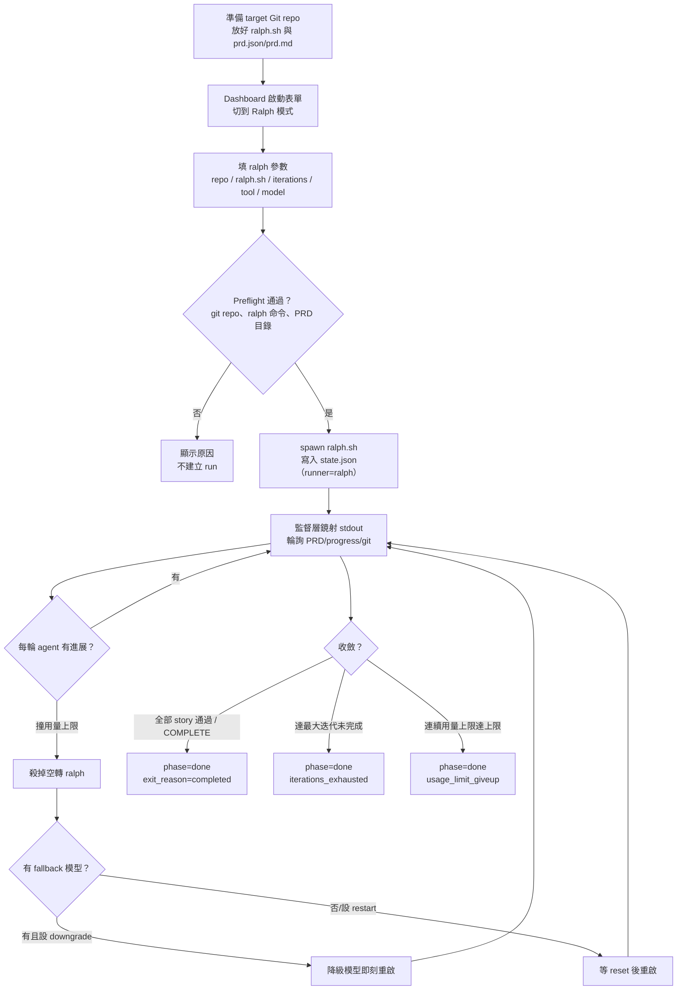
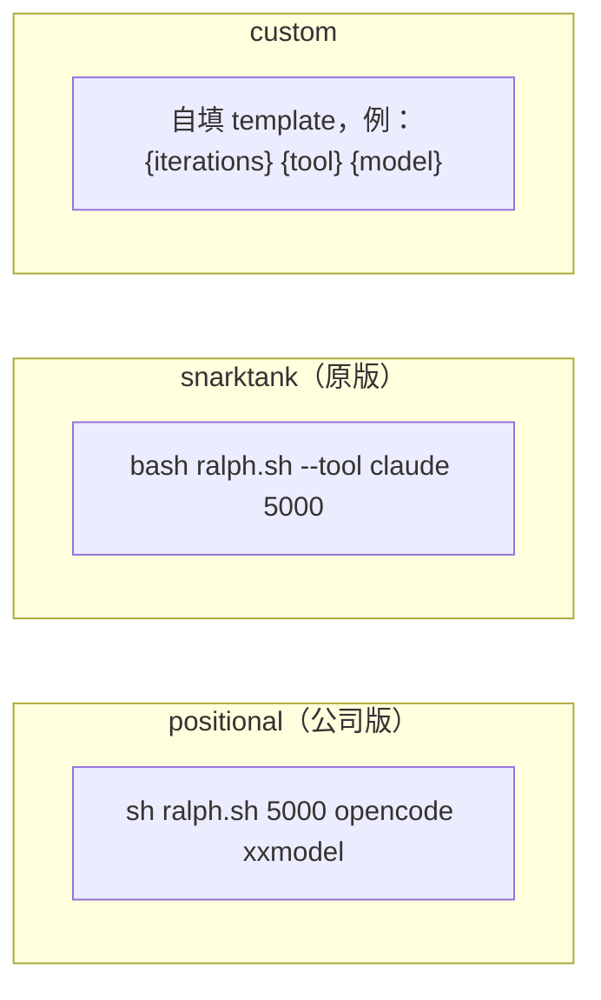
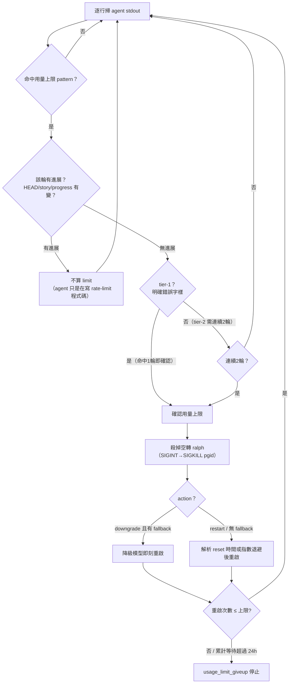
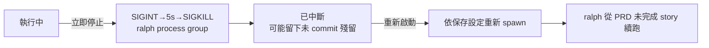

# Ralph runner 使用圖解

這份指南說明如何用 Dashboard 操作原本只能在終端機 `sh ralph.sh …` 執行的
[ralph](https://github.com/snarktank/ralph) 迴圈：準備 PRD、啟動 Ralph runner、監看進度、停止與重啟，
以及 agent 撞到用量上限時的自動重啟／模型降級。架構與設計取捨見
[Ralph 模式接入設計](../ralph-mode-design.md)；loop coordinator 的用法見
[Dashboard 圖解](../dashboard-guide/README.md) 與 [CLI 圖解](../cli-guide/README.md)。

> **Ralph runner 是什麼**：ralph 本身就是一個完整迴圈引擎——每輪起一個全新 context 的 agent，
> 由 agent 自己讀 PRD、寫 code、自己 commit，狀態全在 repo 檔案（`prd.json`／`prd.md`、`progress.txt`、
> git 歷史）。Dashboard 不重寫 ralph，而是加一層**監督層**（`engine/ralph.py`）：spawn `ralph.sh`、
> 把它的 stdout 鏡射到 console、輪詢 PRD／progress／git 把進度投影進 `state.json`。它刻意**不**套用
> loop 的共識、Validate、防竄改機制（那些會誤傷 ralph 自我 commit 的正常行為）。

## 先看完整流程



## 1. 前置條件

- Dashboard 已啟動（`python dashboard.py`），並完成過一次[個人設定](../dashboard-guide/01-first-time-personal-settings.md)。
- Target repo 是 Git repo。
- 手邊有一支可執行的 `ralph.sh`（公司版或 [snarktank/ralph](https://github.com/snarktank/ralph) 原版皆可）。
- 有一份 PRD（`prd.json` 或 `prd.md`），或準備在啟動時匯入。
- ralph 內部呼叫的 agent CLI（例如 `opencode`、`claude`、`amp`）可在 Dashboard 的 PATH 找到。

## 2. 準備 PRD 與檔案位置

ralph 依 **ralph.sh 所在目錄**（SCRIPT_DIR）讀寫它的狀態檔，不一定是 repo root：

```text
<ralph_dir>/                 ← 預設＝ralph.sh 所在目錄（可在表單覆寫）
├── ralph.sh                 你的 ralph 腳本
├── prd.json  或  prd.md     任務真相：user story 清單與完成標記
├── progress.txt             append-only 的逐輪學習紀錄（ralph 自己維護）
└── archive/                 ralph 換 feature 時自動歸檔上一輪（ralph 行為）

<target repo>/               ← agent 實際 commit 程式碼的地方（cwd）
```

### prd.json（snarktank 格式）

```json
{
  "project": "MyApp",
  "branchName": "ralph/task-priority",
  "userStories": [
    { "id": "US-001", "title": "Add priority field", "priority": 1,
      "acceptanceCriteria": ["Migration runs", "Typecheck passes"], "passes": false },
    { "id": "US-002", "title": "Show priority badge", "priority": 2, "passes": false }
  ]
}
```

- `passes: false → true` 就是完成標記；監督層以此算 `Stories x/y`。
- `stories_done == stories_total`（或 stdout 出現 `<promise>COMPLETE</promise>`）視為收斂。

### prd.md（checkbox 格式）

```markdown
# MyApp
branchName: ralph/task-priority

- [x] 已完成的第一個 story
- [ ] 尚未完成的第二個 story
```

- `- [x]` = 完成、`- [ ]` = 未完成；`# 標題` 當專案名、`branchName:` 當分支名。

> 也可以不先放 PRD，在啟動表單直接**貼上匯入**；若 `ralph_dir` 在 repo 內，會順便 commit。

## 3. 啟動：Dashboard Ralph 模式

點右上「＋ 啟動／管理」→ 在啟動表單頂端把 runner 從 **Loop coordinator** 切到 **Ralph**。
Ralph 模式只收 ralph 需要的欄位（**不含** Validate、Agent CLI 切換、flag/done 門檻等 loop 專屬設定）：

| 欄位 | 說明 |
|---|---|
| **Repo** | target repo（沿用 Repo Roots 下拉或手填絕對路徑）。 |
| **Workspace 名稱** | 留空用 repo 名；只允許英數、`.`、`_`、`-`。 |
| **Ralph 命令** | 從團隊白名單 `ralph.scripts` 選，或手填（如 `sh /opt/tools/ralph.sh`）。 |
| **Ralph 目錄** | 選填；prd/progress 所在。留空＝ralph.sh 所在目錄。 |
| **迭代上限** | ralph 最多跑幾輪（例：5000）。 |
| **Tool** | ralph 內部的 agent，如 `opencode`／`claude`／`amp`。 |
| **Model** | 模型字串（原版 snarktank 不用；公司版用）。 |
| **參數風格** | 見下方 §4。決定 iterations/tool/model 怎麼排進 `ralph.sh` 的引數。 |
| **PRD 匯入** | 選填；貼上 `prd.json`／`prd.md` 內容，寫入 ralph_dir（在 repo 內則 commit）。 |
| **進階：用量上限自動重啟** | 見下方 §6。 |

按「啟動」後，Dashboard 會做最小 preflight（是否 git repo、ralph 命令可解析、PRD 目錄存在），
通過才 spawn 監督層並切到該 workspace。

## 4. 參數風格（arg style）

`ralph.sh` 的引數順序在不同版本不同，用「參數風格」對齊，監督層不經 shell 直接 exec（無注入風險）：



- **positional**：`{iterations} {tool} {model}` → `sh ralph.sh 5000 opencode xxmodel`（你公司的用法）。
- **snarktank**：`--tool {tool} {iterations}` → 原版 `ralph.sh --tool claude 5000`（不吃 model）。
- 空的 `{model}` token 會自動略過。

## 5. 監看：RalphView

啟動後 workspace 詳細頁改為 **RalphView**（loop 模式的 WorkspaceView 對應）。版面概念：

```text
┌──────────────────────────────────────────────┬───────────────┐
│ ralph-workspace   [已完成]  [Ralph]           │  Agent 主控台  │
│ 專案 · ⎇分支 · [Stories 3/8] · 迭代 17/5000    │  (共用         │
│ 模型 opus · commits 12 · [PRD 錯誤?]           │   ConsolePane) │
│ ⏳ 用量上限橫幅（命中時）：將於 HH:MM 自動重啟   │   ralph 的     │
├──────────────────────────────────────────────┤   stdout 逐行  │
│ PRD 檢核表         3/8 通過  [查看 PRD 原文]    │   即時鏡射     │
│  ✓ US-001  P1  Add priority field             │               │
│  ○ US-002  P2  Show priority badge            │               │
│  …（展開看 acceptanceCriteria）                │               │
├──────────────────────────────────────────────┤               │
│ 進度紀錄  progress.txt · 迭代 17    [過濾…]     │               │
│  Implemented US-001 …                          │               │
└──────────────────────────────────────────────┴───────────────┘
```

- **狀態列**：`Stories x/y` 進度條、`迭代 n/max`、目前模型（降級時標「已降級」）、commit 數、停滯／PRD 錯誤警示、終態徽章。
- **PRD 檢核表**：live 通過狀態來自 `state.ralph.stories`；展開看驗收條件；「查看 PRD 原文」看完整來源檔。
- **進度紀錄**：`progress.txt` 尾段檢視器（可過濾、跟到最新）——ralph 的學習筆記，等同 loop 的輪次紀錄價值。
- **右側主控台**：沿用 loop 的 ConsolePane，顯示 ralph stdout。
- Fleet 卡片對 ralph workspace 顯示 `Stories x/y`、迭代與 ⏳（用量上限）標記。

RalphView **不顯示** loop 專屬控制：階段切換、flag/done chips、Plan 編輯器、Task Diff、輪次 sparkline、Issues、Timeline、Run 對比——這些對 ralph 沒有對應事實。

## 6. 用量上限自動重啟／模型降級

長跑最大痛點：agent 撞到用量上限時 `ralph.sh` 因 `... || true` 會繼續空轉、幾秒燒光所有迭代卻毫無進展。
監督層用 **heuristic** 偵測 agent stdout 的用量上限訊號，殺掉空轉的 ralph，再依設定重啟。



**關鍵防誤判（no-progress gate）**：只有「命中 pattern」**且**「該輪沒有任何 commit／story／progress 變化」才算用量上限。
agent 若正在實作 rate-limit 相關功能，那一輪會 commit（有進展），因此不會被誤判成用量上限。

進階設定欄位：

| 設定 | 說明 | 預設 |
|---|---|---|
| **用量上限行為** | `等 reset 後自動重啟` / `降級模型即刻重啟` / 關閉。 | 等 reset 後重啟 |
| **降級鏈 fallback_models** | 逗號分隔，如 `sonnet, haiku`；空＝不降級。 | 空 |
| **自動重啟上限** | 連續（無進展）重啟達此數 → `usage_limit_giveup`。 | 6 |

state 會明確標示 `usage_limit.detection: "heuristic"` 與觸發的**原始行**，方便你判斷與調參；等待期間 RalphView 顯示倒數橫幅。

## 7. 停止與重啟



- ralph 沒有輪間控制點，所以**只有「立即停止」**（沒有 loop 的「本輪後停止」）。
- 停止會 SIGINT ralph、寬限後 SIGKILL 整個 process group；殘留由下一次啟動的 fresh-context agent 收拾（ralph 哲學）。
- **重啟＝續跑**：ralph 天然可續跑，PRD 未完成項就是 resume point，不需要 loop 的 Resume 檢查。

## 8. 團隊設定（shared config）

團隊 ralph 設定放在 `engine/dashboard.config.shared.json` 的 `ralph` 區塊（範例已內附）：

```json
{
  "ralph": {
    "scripts": [{ "label": "公司 ralph", "cmd": "sh /opt/tools/ralph.sh" }],
    "tools": ["opencode", "claude", "amp"],
    "default_iterations": 100,
    "default_args_style": "positional",
    "prd_filenames": ["prd.json", "prd.md"],
    "default_usage_limit_action": "restart",
    "default_fallback_models": [],
    "default_auto_restart_max": 6,
    "usage_limit_patterns": ["你們 opencode 撞到上限時的專屬字樣（regex）"]
  }
}
```

> 把公司 `opencode` 撞上限時實際印出的字串加進 `usage_limit_patterns`（視為 tier-2），偵測會更可靠，
> 不用只依賴內建的通用 pattern。

## 9. 與 loop coordinator 的差異

| 面向 | Loop coordinator | Ralph runner |
|---|---|---|
| 迴圈引擎 | `engine/loop.py`（本專案） | 外部 `ralph.sh`（監督＋投影） |
| 任務真相 | `state.json` 的 plan／共識門檻 | repo 內 `prd.json`／`prd.md` |
| 逐輪紀錄 | history.log／輪次判定 | `progress.txt` |
| 完成判定 | done 共識、REPORT.md | 全 story 通過 / `<promise>COMPLETE</promise>` |
| Validate／防竄改／reset | 有 | 無（ralph 自管） |
| 停止選項 | 本輪後停止＋立即停止 | 只有立即停止 |
| 續跑 | 一般執行／Resume 檢查 | 重啟即續跑（PRD 未完成項） |
| 用量上限 | agent 失敗退避 | heuristic 偵測＋自動重啟／降級 |

## 10. 疑難排解

| 症狀 | 可能原因與處理 |
|---|---|
| 狀態列出現「PRD 錯誤」 | `prd.json`／`prd.md` 格式不合或路徑不對；用「查看 PRD 原文」核對，或修正 `prd_path`／`ralph_dir`。 |
| Stories 一直 0/0 | 監督層讀不到 PRD；確認 `ralph_dir` 指向 ralph.sh 讀 PRD 的目錄（SCRIPT_DIR）。 |
| 撞到上限卻沒自動重啟 | 內建 pattern 沒命中公司 opencode 的訊息；把該訊息加進 `usage_limit_patterns`（tier-2）。 |
| 停止後 repo 還有殘留 | 正常；下一次啟動的 agent 會先收拾現場。若要乾淨，手動 `git reset --hard` 再重啟。 |
| 「另一個 ralph run 正在用相同 ralph 目錄與 PRD」 | 兩個 ralph 共用同一 `ralph_dir` 會互相覆蓋 prd/progress；為第二個指定不同的 `ralph_dir`。 |
| 找不到 tool（opencode/claude） | ralph 內部呼叫的 agent 不在 Dashboard PATH；到 Agent CLI 管理器補 `extra_path_dirs`。 |
